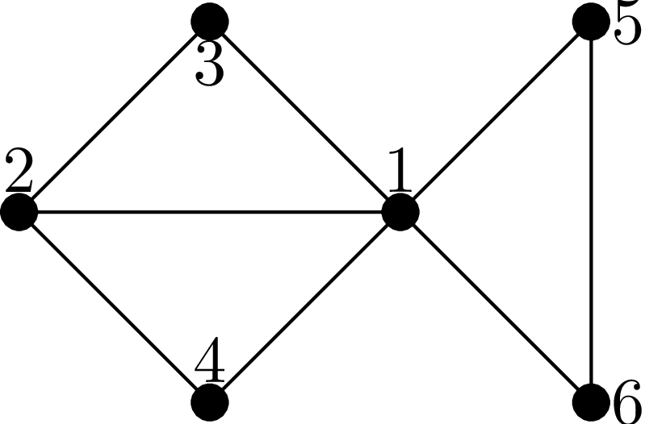
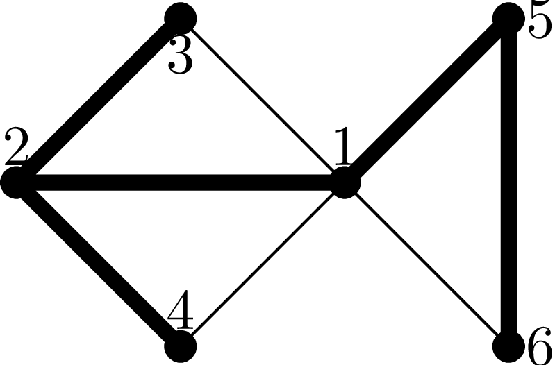

Элементарная реализация и общие замечания
-----------------------------------------

Поиск в глубину — довольно простой алгоритм, даже может быть
не алгоритм, а идея, но имеющий много применений и вариантов.
Он применяется для огромного количества разных задач.
Поэтому вместо того, чтобы как положено сначала сформулировать
задачу, а потом уже рассказывать алгоритм, я поступлю наоборот:
я сначала приведу код алгоритма и объясню, что он делает и как работает,
не объясняя, зачем это надо и как это вам поможет,
а потом весь оставшийся раздел мы будем обсуждать, как и где
это применяется.

Реализация
^^^^^^^^^^

Итак, что такое поиск в глубину. Поиск в глубину — это рекурсивный
алгоритм обхода графа. Он принимает на вход некоторую вершину графа и
рекурсивно запускает себя для всех ещё не посещённых соседей данной
вершины. Таким образом, у нас в каждый момент про каждую вершину мы
знаем, были мы в ней уже или ещё нет. При входу в очередную вершину мы
помечаем, что мы в ней были, и рекурсивно идем во все соседние с ней
вершины, в которых ещё не были. Элементарная реализация поиска в глубину
тогда получает следующий вид (считаем, что мы храним граф матрицей
смежности):

::

    procedure find(i:integer);
    begin
    was[i]:=1;
    for j:=1 to n do
        if (gr[i,j]=1)and(was[j]=0) then
           find(j);
    end;

Здесь :math:`gr` — матрица смежности, :math:`was` — тот самый массив, в
котором мы храним, были мы уже в этой вершине или нет ещё.

В принципе, это абсолютно корректный вариант реализации, но я лично
предпочитаю другой вариант: как в любых рекурсивных процедурах, я
предпочитаю проверять необходимость рекурсивного вызова при *входе* в
процедуру, а не *при её вызове* (конечно, пока это возможно). Конкретно,
в данном случае я предпочитаю перекинуть проверку :math:`was[j]=0` в
начало процедуры:

::

    procedure find(i:integer);
    begin
    if was[i]<>0 then
       exit;
    was[i]:=1;
    for j:=1 to n do
        if gr[i,j]=1 then
           find(j);
    end;

(обратите внимание, что, конечно, проверка из :math:`was[j]`
превратилась в :math:`was[i]`).

.. note::
   Смысл такого переноса проверок в общем случае рекурсивных процедур (в
   первую очередь в случае перебора) в том, что 1. если вы вызываете вашу
   процедуру из нескольких мест в коде, то не надо каждый раз дублировать
   проверку, 2. нередко в начале процедуры проверка смотрится как-то
   естественнее (естественнее по максимуму работать с :math:`i`-ой
   вершиной, т.к. именно она является параметром процедуры), и иногда эту
   проверку тут написать проще. С другой стороны, такой перенос приводит к
   дополнительным затратам времени на вызов функции при выполнении
   программы, но по-моему в большинстве случаев эти затраты несущественны
   (время выполнения самой процедуры обычно много больше). Правда, в случае
   поиска в глубину все эти преимущества почти незаметны, т.к.
   :math:`was[i]<>0` — фактически единственная проверка, которую получается
   перенести (совершенно понятно, что проверку :math:`gr[i,j]=1` переносить
   невозможно и вообще бессмысленно), к тому же процедура find обычно
   вызывается максимум из двух мест в коде, поэтому экономии от переноса
   нет, так что здесь это скорее дело вкуса.

.. _howtocall:

Как вызывать процедуру :math:`find`
^^^^^^^^^^^^^^^^^^^^^^^^^^^^^^^^^^^

Конечно, сама по себе процедура ничего не сделает; чтобы её
использовать, нужно её вызвать в главной программе (или, естественно, в
другой процедуре, где вам понадобилось запустить поиск в глубину, и
т.п.). Способ вызова, конечно, зависит от задачи, но наиболее часто
используются два варианта: либо нужно просто запустить поиск в глубину
из данной вершины и всё — это, естественно, делается просто вызовом
:math:`find(i)`, где :math:`i` — номер этой вершины, либо нужно
запустить поиск так, чтобы обойти обязательно все вершины — тогда пишем
так:

::

    for i:=1 to n do
        if was[i]=0 then
           find(i);

Конечно, если сам поиск написан вторым способом (т.е. с проверкой
:math:`was` при входе в процедуру), то if из этого кода можно убрать.

И ещё, конечно, нужно не забыть предварительно занулить массив
:math:`was`.

Пример работы
^^^^^^^^^^^^^

Пусть у нас есть граф, показанный на рис. Запустим на нем поиск в
глубину из вершины 1. Пусть (в соответствии с тем, как это написано в
приведённых выше реализациях) при просмотре соседних вершим мы
перебираем вершины в порядке возрастания номеров. Тогда алгоритм поиска
будет работать следующим образом (отступ строки соответствует уровню
рекурсии):

| ``find(1)``: запускаем поиск в глубину из вершины 1
|   Помечаем, что побывали в вершине 1
|   Просматриваем соседей вершины 1
|   Нашли соседа: вершину 2
|   В вершине 2 ещё не были
|   ``find(2)``: запускаем поиск в глубину из вершины 2
|     Помечаем, что побывали в вершине 2
|     Просматриваем соседей вершины 2
|     Нашли соседа: вершину 1
|     В вершине 1 уже были, поиск из вершины 1 не запускаем  [1]_
|     Нашли соседа: вершину 3
|     В вершине 3 ещё не были
|     ``find(3)``: запускаем поиск в глубину из вершины 3
|       Помечаем, что побывали в вершине 3
|       Просматриваем соседей вершины 3
|       Нашли соседа: вершину 1
|       В вершине 1 уже были, поиск из вершины 1 не запускаем
|       Нашли соседа: вершину 2
|       В вершине 2 уже были, поиск из вершины 2 не запускаем
|       Соседи вершины 3 закончились, завершаем поиск из вершины 3
|     *(продолжаем просмотр соседей вершины 2)*  [2]_
|     Нашли соседа: вершину 4
|     В вершине 4 ещё не были
|     ``find(4)``: запускаем поиск в глубину из вершины 4
|       Помечаем, что побывали в вершине 4
|       Просматриваем соседей вершины 4
|       Нашли соседа: вершину 1
|       В вершине 1 уже были, поиск из вершины 1 не запускаем
|       Нашли соседа: вершину 2
|       В вершине 2 уже были, поиск из вершины 2 не запускаем
|       Соседи вершины 4 закончились, завершаем поиск из вершины 4
|     *(продолжаем просмотр соседей вершины 2)*
|     Соседи вершины 2 закончились, завершаем поиск из вершины 2
|   *(продолжаем просмотр соседей вершины 1)*
|   … (нашли соседей: вершины 3 и 4, поиск из них не запускаем, для краткости не описываю это подробно)
|   Нашли соседа: вершину 5
|   В вершине 5 ещё не были
|   ``find(5)``: запускаем поиск в глубину из вершины 5
|     Помечаем, что побывали в вершине 5
|     Просматриваем соседей вершины 5
|     Нашли соседа: вершину 1
|     В вершине 1 уже были, поиск из вершины 1 не запускаем
|     Нашли соседа: вершину 6
|     В вершине 6 ещё не были
|     ``find(6)``: запускаем поиск в глубину из вершины 6
|       Помечаем, что побывали в вершине 6
|       Просматриваем соседей вершины 6
|       Нашли соседа: вершину 1
|       В вершине 1 уже были, поиск из вершины 1 не запускаем
|       Нашли соседа: вершину 5
|       В вершине 5 уже были, поиск из вершины 5 не запускаем
|       Соседи вершины 6 закончились, завершаем поиск из вершины 6
|     *(продолжаем просмотр соседей вершины 5)*
|     Соседи вершины 5 закончились, завершаем поиск из вершины 5
|   *(продолжаем просмотр соседей вершины 1)*
|   Нашли соседа: вершину 6
|   В вершине 6 уже были, поиск из вершины 6 не запускаем
|   Соседи вершины 1 закончились, завершаем поиск из вершины 1

Тут виден, пожалуй, первый полезный факт про поиск в глубину: 
что поиск в глубину обошел все вершины, достижимые из первой вершины,
т.е. всю компоненту связности.

(На самом деле очень нетривиально придумать один небольшой пример,
который бы полностью характеризовал все особенности поиска в глубину.
Поэтому, если вам что-то во внутреннем механизме работы поиска ещё не
понятно, или не будет понятно в дальнейшем, то порисуйте ещё графы и промоделируйте вручную работу поиска на
них.)

Дерево поиска в глубину
^^^^^^^^^^^^^^^^^^^^^^^

У каждой вершины, кроме той, из которой был произведён начальный запуск
поиска («корня»), можно выделить «родителя» — вершину, из которой мы
перешли в данную вершину. Соединив каждую вершину (кроме корня, конечно)
с её родителем, получим подграф исходного графа — *дерево поиска в
глубину*.

.. task::

    Докажите, что действительно получится дерево. Точнее,
    докажите, что в полученном подграфе не будет циклов. Верно ли, что это
    всегда будет дерево, покрывающее все вершины исходного графа? Как это
    зависит от того, как мы вызываем поиск в глубину (раздел
    :ref:`howtocall`)? На самом деле доказательство не очень
    тривиально.
    |
    |
    То, что не будет циклов, видимо, можно доказывать
    многими способами. Приведу идею самого простого из пришедших мне сейчас
    в голову доказательств. Пронумеруем все вершины в том порядке, в котором
    мы их находили. В дереве поиска в глубину из каждой вершины :math:`u`
    выходим несколько (ноль или больше) рёбер в её «сыновья» — вершины,
    которые мы нашли из :math:`u`, значит, их номера больше, чем у
    :math:`u`, — а также ровно одно ребро в «предка» — вершину, *из* которой
    мы нашли :math:`u` (такие ребра есть у всех вершин, кроме корня) — номер
    этой вершины меньше, чем у :math:`u`. Пусть есть цикл. Рассмотрим в нем
    вершину с наибольшим номером. В неё входят *два* ребра, принадлежащие
    этому циклу, и потому идущие и вершин с *меньшими* номерами, чем у
    нашей. Противоречие.
    
    В случае связного графа это всегда будет остовное дерево графа, т.е.
    покрывающее все вершины. Но в случае несвязного графа это будет или
    остовное дерево одной компоненты связности — если запускаем просто
    :math:`find(i)`, — или остовный лес, покрывающий все вершины — если
    запускаем вторым из перечисленных в разделе :ref:`howtocall` способом.
    
    |

.. _provetree:

На рисунке приведено дерево для примера из предыдущего пункта.

Собственно, поиск в глубину — самый, пожалуй, простой алгоритм
построения в связном графе *остовного* дерева (т.е. дерева, покрывающего
все вершины графа). Если вам зачем-то понадобилось *любое* остовное
дерево, пользуйтесь поиском в глубину. Кроме того, дерево поиска в
глубину нам ещё пригодится при решении задач ниже.

Оценка сложности
^^^^^^^^^^^^^^^^

Какова сложность поиска в глубину? Во-первых, замечу, что здесь, как и
на любых задачах на графы, 1. сложность принято оценивать как функцию
*двух* параметров — количества вершин :math:`V` и количества рёбер
:math:`E`, и 2. сложность зависит от того, каким образом мы храним граф
в памяти.

В первом варианте реализации очевидно, что процедура :math:`find` ни для
какого параметра не будет вызвана дважды (т.е. :math:`find(1)` будет
вызвана максимум один раз за время работы программы, :math:`find(2)`
тоже максимум один раз и т.д.), поскольку перед каждым вызовом мы
проверяем, а не были ли мы уже в этой вершине [3]_. Поэтому общее
количество вызовов будет :math:`O(V)`. Сложность работы каждой процедуры
(не считая времени работы рекурсивных вызовов) есть :math:`O(V)`, т.к. в
ней просто цикл, поэтому общая сложность поиска в глубину будет
:math:`O(V^2)`.

Для второго варианта оценка сложности будет, конечно, в точности такая
же: *полноценных* запусков процедуры, т.е. таких, которые не выйдут тут
же по первой проверке, будет тоже :math:`O(V)`, а время, потраченное на
остальные (на каждый — :math:`O(1)` времени), можно учесть во времени
выполнения цикла в вызывающей процедуре, таким образом сложность
:math:`O(V^2)`. Понятно, что вообще в общем случае от переноса проверки
в начало процедуры сложность работы алгоритма не изменится, поскольку
общее количество действий фактически осталось тем же (проверок будет
столько же; добавится только время на вызовы функций, но лишних вызовов
будет столько же, сколько и проверок, поэтому сложность не изменится).

Это все относится к случаю, когда граф мы храним матрицей смежности. Но
можно хранить граф списком смежных вершин или любым другим способом,
позволяющим перебрать соседей вершины за
``O(количество этих соседей)`` (например, стандартными списками смежности,
или даже списком рёбер, отсортированным по первой вершине, 
или вообще не хранить граф, а
вычислять соседние вершины «на лету», как, например, в различных задачах
типа хождения коня по шахматному полю — там мы, конечно, не будем
хранить ребра вообще, а будем просто перебирать все клетки, на которые
можно попасть с текущей). Тогда суммарное время работы всех таких
переборов будет
``O(суммарное количество соседей всех вершин)``, т.е.
:math:`O(E)`, а общее время оставшейся работы будет :math:`O(V)`, т.е.
общее время работы алгоритма будет :math:`O(V+E)`. В большинстве случаев
:math:`E>V`, поэтому часто говорят, что сложность работы поиска в
глубину есть :math:`O(E)`. Это, в общем-то, не совсем корректно, но
ошибка обычно не страшна (т.к., например, обычно в ограничениях задачи
все-таки :math:`maxE>maxV`, и т.п.). Таким образом, достаточно точно
можно сказать, что время работы поиска в глубину на списке смежных
вершин есть :math:`O(E)`. Замечу особый случай: если степень вершин
графа не превышает некоторой маленькой константы (например, при хождении
коня по шахматной доске степени вершин не превышают 8), то
:math:`E=O(V)` и сложность работы алгоритма есть :math:`O(V)`.

По-видимому, сейчас при использовании поиска в глубину в большинстве
случаев не стоит использовать матрицу смежности, т.к. нередки задачи с
ограничениями типа :math:`V\leq 10\,000`, :math:`E\leq 100\,000`, так
что :math:`O(E)`-алгоритм пройдёт, а :math:`O(V^2)` — нет. Но, как
всегда, выбор способа хранения графа в каждой задаче свой. Анализируйте
ограничения и соответственно выбирайте способ хранения графа.

Дополнительные замечания
^^^^^^^^^^^^^^^^^^^^^^^^

Нередко при обсуждении элементарного поиска в глубину сразу дают ещё
кучу информации, например, деление вершин на *три* класса: непосещённые,
обрабатываемые сейчас и уже обработанные (вместо, как у нас, двух
классов — в которых мы ещё не побывали и в которых мы уже побывали),
классификация рёбер, времена входа/выхода и т.п. Но на самом деле они
бывают нужны *далеко не во всех* применениях поиска в глубину, поэтому я
буду говорить о них только тогда, когда они понадобятся.

.. [1]
   Или, если реализовано вторым способом, запускаем, но тут же выходим
   назад.

.. [2]
   Обратите внимание, что это происходит автоматически: работа процедуры
   ``find(3)`` завершилась, поэтому продолжается работа программы с того
   места, откуда была вызвана процедура ``find(3)`` — а это есть строчка
   в цикле в процедуре ``find(2)``, поэтому просто происходит переход к
   следующей итерации цикла в ``find(2)``, т.е. продолжаем просмотр
   соседей вершины 2. Поэтому эта строчка здесь и написана курсивом —
   ей, можно сказать, не соответствует никакая строка исходного текста
   программы.

.. [3]
   Конечно, подразумевается, что вызов процедуры :math:`find` из главной
   программы сделан соответствующим образом — чтобы не получилось, что
   процедура будет дважды запущена с одним и тем же параметром

