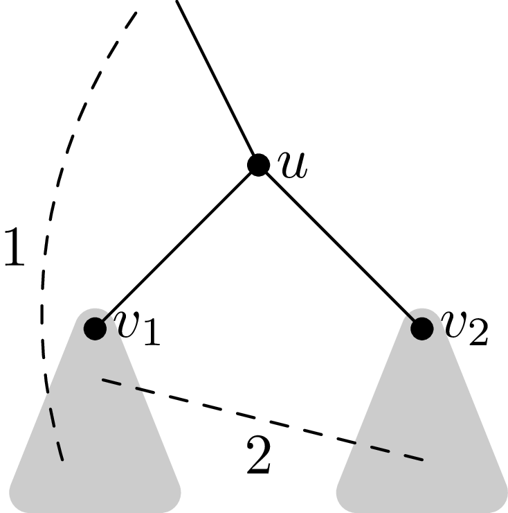

Мосты и точки сочленения
========================

В этой теме рассматриваем опять только неориентированные графы.

*Мостом* в неориентированном графе называется ребро, при удалении
которого количество компонент связности графа увеличивается.

*Точкой сочленения* в неориентированном графе называется вершина, при
удалении которой количество компонент связности графа увеличивается.

.. _bridgeone:

.. task::

    Постоянно, когда формулирую определения, хочется сказать
    «компонент связности увеличивается на одну». Можно ли так говорить, т.е.
    будут ли получающиеся определения эквивалентны тем, что даны выше?
    |
    
    
    |
    Для мостов можно. Для точек сочленения нет, т.к. может оказаться,
    что при удалении вершины старая компонента связности распадается сразу
    на три или ещё больше. Обратите также внимание, что нельзя говорить
    «мост — это такое ребро, при удалении которой граф распадётся на *две*
    компоненты связности» и аналогично для точек сочленения, т.к. не
    понятно, что это значит для несвязных графов, и в наиболее логичной
    трактовке для несвязных графов это неверно.
    |

.. _bridgesandSV:

.. task::

    Есть ли какая-нибудь простая связь между мостами и точками
    сочленения? Т.е. верно ли, что а) каждый конец моста — это точка
    сочленения? б) каждая точка сочленения является концом некоторого моста?
    в) может быть, ещё что-нибудь придумаете?
    |
    
    |
    Я такой связи не
    знаю. а) нет, т.к. конец моста может оказаться висящей вершиной. Вообще,
    например, в графе с двумя вершинами и одним ребром (1–2) один мост, но
    ни одной точки сочленения. б) Очевидно, нет, и несложно придумать
    контрпример.
    |

Перекрёстные ребра
------------------

Одним из важнейших свойств поиска в глубину является следующее. В дереве
поиска в глубину (как, конечно, и вообще в любом дереве с корнем) для
любой вершины можно определить её предков — т.е. те вершины, которые
лежат по дороге от корня дерева к этой вершине, — а также можно
определить потомков данной вершины — т.е. те вершины, на пути от которых
до корня лежит наша. Т.е. вершина :math:`u` является потомком :math:`v`
тогда и только тогда, когда :math:`v` является предком :math:`u`.

Тогда оказывается, что дерево поиска в глубину (в неориентированном графе!) так устроено, что *любое
ребро графа* соединяет две вершины, одна из которых является предком
другой в этом дереве (а, соответственно, вторая является потомком
первой). Если представить себе дерево подвешенным за корень, то все
ребра идут сверху вниз (или, что то же самое, снизу вверх — граф-то
неориентированный), возможно, пропуская несколько вершин (в смысле, что
не обязательно соединяют вершину с её непосредственным потомком, а,
возможно, с более дальним). Говоря по-другому, в графе отсутствуют
*перекрёстные ребра*, т.е. ребра, которые идут «поперёк» дерева, из
одного поддерева в совсем другое: каждое ребро идёт из вершины в
поддерево этой вершины (или наоборот). Об этом свойстве чаще всего
говорят как о свойстве отсутствия перекрёстных рёбер в дереве поиска в
глубину.

Может быть, это не очень понятно сформулировано — порисуйте графы и
попробуйте понять. Это на первый взгляд очень удивительное свойство, и
по началу вообще не верится, что такое дерево вообще может существовать,
но порисуйте графы и вы убедитесь в этом. (Вообще, как надо рисовать тут
графы? Ясно, что надо рисовать не какой попало граф, а с определённой
целью, пытаясь подобрать контрпример — тогда, может быть, намного чётче
станет ясно, почему так происходит и, может быть, вы даже сумеете сами
это доказать).

.. task::

    Докажите это свойство.
    |
    Пусть есть перекрёстное ребро.
    Рассмотрите тот его конец, в который мы при поиске в глубину попали
    раньше. При просмотре его соседей мы должны будем наткнуться на другой
    конец этого же ребра. Пойдём ли мы в него?
    |
    Пусть есть такое ребро.
    Рассмотрим тот конец его, в который мы попали раньше — пусть это вершина
    :math:`u`. К моменту, когда мы попали в него, во второй конец
    (:math:`v`) мы ещё на заходили. Мы будем просматривать соседей вершины
    :math:`u` и наткнёмся на :math:`v`. Если к этому моменту мы все ещё не
    были в :math:`v`, то мы в неё пойдём, :math:`v` станет сыном и потому
    потомком :math:`u` и ребро не будет перекрёстным. В противном случае мы
    успели побывать в вершине :math:`v`, пока обрабатывали других соседей
    вершины :math:`u`, значит, :math:`v` — потомок :math:`u` и ребро все
    равно не перекрёстное.
    |

.. _crossedges:

Этот факт нередко рассказывают сразу, как только начинают рассказывать
поиск в глубину, но, как мы видели, он, как правило, не нужен нигде,
кроме текущего раздела — мостов и точек сочленения.

Поиск точек сочленения
----------------------

Основная идея поиска точек сочленения состоит в том, что максимум, на
что может распасться граф при удалении вершины — это поддеревья (дерева
поиска в глубину) ниже этой вершине и весь оставшийся граф.
Соответственно, вершина *не* является точкой сочленения тогда и только
тогда, когда её можно «обойти» из любого поддерева, т.е. если из
какой-нибудь вершины ниже этой есть ребро куда-то в оставшуюся часть
дерева. (Точнее, если у нашей вершины несколько потомков в дереве поиска
в глубину, то ребро должно быть из каждого поддерева с корнем в этих
потомках.)

На рисунке выше приведён пример ко всему, о чем говорилось. Здесь
некоторая вершина :math:`u`, её сыновья в дереве поиска в глубину
:math:`v_1` и :math:`v_2`, серым условно показаны поддеревья с корнями
:math:`v_1` и :math:`v_2` (т.е. множества всех потомков :math:`v_1` и
:math:`v_2`). Дерево показано подвешенным, т.е. сверху где-то (не
показан) — корень, а все рёбра дерева идут вниз. Свойство отсутствия
перекрёстных рёбер утверждает, что в графе не могут существовать ребра
типа ребра 2, т.е. идущие из одного поддерева в другое. А вот ребро типа
1 может существовать (при условии, что оно идёт в вершину, являющуюся
предком :math:`u`). Именно оно и будет тем «обходным» ребром, которое
позволит поддереву с вершиной в :math:`v_1` не отделиться, когда удалим
вершину :math:`u`. Т.е. чтобы проверить, не является ли вершина
:math:`u` точкой сочленения, надо проверить, есть ли ребра типа 1 для
всех её сыновей, т.е. есть ли ребра, идущие из всех поддеревьев её
сыновей, вверх выше :math:`u`.

А проверить это довольно просто. Ведь такие ребра не могут идти никуда,
кроме как в предков вершины :math:`u`. А они (предки) образуют прямой
путь от корня дерева поиска в глубину до вершины :math:`u` и упорядочены
в этом дереве по порядку. Если для каждой вершины ввести её глубину как
расстояние (в дереве поиска в глубину) от корня до этой вершины, то все
вершины в пути от корня до :math:`u` получатся идущими в порядке
увеличения глубины. Тогда, если подумать, то понятно, что, для проверки
наличия обходного ребра достаточно для каждой вершины уметь находить
*вершину с наименьшей глубиной, в которую идут ребра из поддерева с
корнем в нашей вершине*. Т.е., например, для :math:`v_1` найдём вершину
с наименьшей глубиной (т.е. самую близкую к корню), в которую идут ребра
или из самой :math:`v_1`, или из её потомков — т.е. из всего
соответствующего серого треугольника. Таким ребром будет или ребро 1,
или ребра, которые идут ещё выше — короче говоря, если найденная таким
образом вершина будет лежать выше, чем :math:`u`, то это будет
обозначать наличие обходного ребра, иначе такого обходного ребра нет.
Таким образом мы уже получили алгоритм поиска точек сочленения, но
все-таки код алгоритма я приведу в два этапа.

Итак, сначала научимся находить такие вершины. Точнее, для каждой
вершины мы научимся находить собственно *глубину* самой неглубокой
вершины, в которую идут ребра из нашей вершины или из её потомков.
Находить это легко — эта глубина равна минимуму между глубинами всех
вершин, куда идут ребра конкретно из нашей вершины и между ответами на
такую же задачу для всех сыновей. Т.е., если мы уже вычислили такую
минимальную глубину для всех сыновей, то взяв минимум этих значений и
учтя все рёбра, который напрямую из текущей вершину куда-то идут,
получим ответ — такую минимальную глубину — для нашей вершины. Легко
реализовать это так, чтобы :math:`find` стала функцией, которая будет
возвращать этот самый ответ. Кроме того, для удобства будем в
:math:`find` передавать глубину обрабатываемой вершины (чтобы не
вычислять её каждый раз заново) и будет эту самую глубину сохранять
прямо в массиве :math:`was`. При этом потребуется глубину корня считать
единичной (а в других случаях можно было бы считать её и нулевой).

::

    function find(i,d:integer):integer;
    var j,min,t:integer;
    begin
    was[i]:=d;
    min:=n+1;
    for j:=1 to n do
        if (gr[i,j]<>0) then begin
           if was[j]=0 then begin
              t:=find(j,d+1);
              if t<min then
                 min:=t;
           end else begin
               if was[j]<min then
                  min:=was[j];
           end;
        end;
    find:=min;
    end;

Обратите внимание, что я опять перенёс проверку :math:`was[j]=0` внутрь
цикла. Параметр :math:`d` — глубина текущей вершины, поэтому вызываем
этот алгоритм, конечно, командой ``if was[…]=0 then find(…,1)``.

.. _dots:

.. task::
    :name: Контрольный вопрос

    Что должно быть на месте многоточия?
    |
    
    
    |
    Ну понятно, переменная внешнего цикла, в котором мы запускаем поиск
    в глубину. См. раздел :ref:`howtocall`. 
    |

Что за муть тут понаписана? Все дополнения к стандартному поиску в
глубину здесь делятся на две части. Во-первых, возня с :math:`d`.
Параметр :math:`d` при первом запуске (т.е. для корня) равен единице, а
для каждого сына увеличивается на один (за счёт того, что написано
:math:`find(j,d+1)`, таком образом он действительно отражает глубину
вершину, поэтому по окончании поиска в глубину в :math:`was`
действительно лежат глубины вершин.

Во-вторых, возня с :math:`min` и возвращаемым значением функции
:math:`find`. Функция должна вернуть ответ на нашу задачу, т.е.
наименьшую из глубин вершин, в которые ведут ребра из нашей вершины или
из её потомков. Вычисляем его мы следующим образом. Изначально
присваиваем ему бесконечно большое значение, которое в данном случае
равно :math:`n+1` (:math:`n` — количество вершин в графе; очевидно, что
никакая глубина не может превосходить :math:`n`). Далее перебираем всех
соседей текущей вершины. Могут быть два варианта. Если :math:`was[j]=0`,
то в этой вершине мы ещё не были. Поэтому идём в неё, вызывая рекурсивно
:math:`find`, и, более того, :math:`j` становится сыном :math:`i`,
поэтому в поиске минимума надо учесть все ребра, выходящие из его
поддерева. Но это делается легко: как раз вызов :math:`find(j,\dots)` и
вычислит минимум по всем рёбрам, выходящим из поддерева, осталось нам
сравнить его с :math:`min` и при необходимости наш текущий минимум
подкорректировать. Если же :math:`was[j]\neq 0`, то в вершине :math:`j`
мы уже были и потому осталось лишь узнать её глубину и сравнить с
текущим минимумом. Но её глубину мы уже знаем — она уже лежит в
:math:`was[j]`, поэтому просто сравниваем. (Обратите внимание, что в
этом случае нам нужна именно глубина самой :math:`j`, а не ответ на
задачу для :math:`j`, т.к. :math:`j` не становится сыном :math:`i`.)

Замечу, что это — один из сравнительно простых примеров динамического
программирования на дереве. Ещё замечу, что именно из-за того, что все
равно надо рассматривать эти два случая, я и перенёс проверку
:math:`was[j]=0` из начала процедуры сюда.

Итак, раз теперь понятно, как работает эта функция, осталось научиться
определять, является ли текущая вершина точкой сочленения. Это уже
просто. При удалении текущей вершины число компонент связности может
увеличиться, только если какой-то сын отвалится вместе со своим
поддеревом. Но про каждого сына мы знаем, отвалится ли он: если ответ на
нашу задачу (т.е. минимальная глубина вершин, куда идут ребра из этого
сына или его потомков) меньше, чем глубина :math:`d` текущей вершины, то
не отвалится, иначе отвалится. Т.е. осталось лишь добавить проверку
:math:`t\geq d`:

::

    function find(i,d:integer):integer;
    var j,min,t:integer;
        ok:boolean;
    begin
    was[i]:=d;
    min:=n+1;
    ok:=false;
    for j:=1 to n do
        if (gr[i,j]<>0) then begin
           if was[j]=0 then begin
              t:=find(j,d+1);
              if t<min then
                 min:=t;
              if t>=d then
                 ok:=true;
           end else begin
               if was[j]<min then
                  min:=was[j];
           end;
        end;
    find:=min;
    if ok then
       вершина i --- точка сочленения
    end;

Т.е. если отвалится хотя бы один сын, то вершина :math:`i` — точка
сочленения. Обратите внимание, что проверка выглядит именно как
:math:`t\geq d`, а не :math:`t>d`: если ребро идёт прямо в :math:`i`-ую
вершину, то все равно поддерево отвалится.

Отмечу только, что особой обработки требует корень дерева поиска в
глубину. Можете подумать, почему вышеприведённый алгоритм тут не
годиться, а я скажу, что корень является точкой сочленения тогда и
только тогда, когда он имеет более одного сына. Окончательную версию
алгоритма я приводить не буду, замечу только, что узнать в процедуре
:math:`find`, является ли текущая вершина корнем, можно легко: у корня и
только у него :math:`d=1`.

Поиск мостов
------------

Можно пытаться искать мосты аналогично. Очевидно, что все мосты войдут в
дерево поиска в глубину. Более того, ребро дерева будет мостом тогда и
только тогда, когда нет обходных вокруг него рёбер, т.е. когда для
нижнего конца этого ребра функция :math:`find` возвращает значение не
меньше, чем глубина этого нижнего конца.

.. _bridgesstupid:

.. task::

    Додумайте этот алгоритм и напишите его.
    |
    
    |
    Приводить
    алгоритм тут не буду, пишите сами :)
    |

Но для поиска мостов есть другой, возможно, более простой алгоритм. Запустим поиск
в глубину в нашем графе и ориентируем все ребра в том направлении, в
котором мы их в первый раз просматривали, т.е. все ребра дерева — вниз,
от корня, а все остальные ребра — вверх, к корню. Тогда несложно понять
(и сложнее доказать :) ), что достаточно в полученном графе найти
сильносвязные компоненты: мостами в исходном графе будут как раз те
рёбра, которые идут из одной сильносвязной компоненты в другую.
(Нарисуйте пример и проверьте!) Поиск сильносвязных компонент делается,
как мы уже знаем, двумя поисками в глубину, но мы уже один сделали,
поэтому можно воспользоваться его результатами для запуска второго
поиска. Таким образом, за два поиска в глубину ищутся мосты.

.. _bridgesadv:

.. task::

    Додумайте этот алгоритм и напишите его.
    |
    
    |
    Аналогично
    предыдущему. Мне кажется, что, если вы хорошо освоились с поиском в
    глубину, то придумать и написать *этот* алгоритм труда не должно
    составить.
    |

