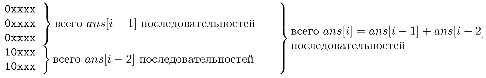

Определение объекта по номеру и номера по объекту
==================================================

«Базовые», простейшие, задачи на ДП обычно касаются подсчета количества
объектов или поиска более-менее любого объекта из некоторого множества.
Мы уже много таких задач видели.

Но есть еще два класса задач, которые тоже решаются с помощью ДП.
В каком-то смысле это развитие темы про вывод лексикографически первого решения,
но в существенно более продвинутом варианте.

Вывод :math:`k`-ого объекта
---------------------------

В задаче могут попросить по данному :math:`k` вывести :math:`k`-ый в некотором порядке
объект. Например, пусть в задаче про 01-последовательности нас не просто
просят посчитать количество хороших последовательностей длины :math:`N`,
а просят вывести :math:`k`-ую в лексикографическом порядке из них
(конечно, гарантируя, что :math:`k` не превосходит общего количества
таких последовательностей).

Как это сделать? На самом деле это делается легко и весьма похоже на
вывод *какой-нибудь* хорошей последовательности, что по сути мы с вами
уже обсуждали. (Мы уже даже обсуждали, что можно легко сделать так,
чтобы выводился *первый* в лексикографическом порядке объект.) Поэтому
давайте предварительно методом ДП посчитаем количество хороших
последовательностей длины :math:`i` для всех :math:`i` от 1 до :math:`N`
(ну или от нуля, вам виднее). А дальше...

А дальше раньше мы писали процедуру :math:`out(i)`, которая выводила
*любую* хорошую последовательность длины :math:`i`. Теперь нам надо
выводить не какую попало, а вполне определённую — поэтому давайте
напишем процедуру :math:`out(i,k)`, которая будет выводить :math:`k`-ую
в лексикографическом порядке последовательность среди всех хороших
последовательностей длины :math:`i`.

Как это делать? Попробуем воспользоваться тем, что мы знаем, как
выглядит любая хорошая последовательность длины :math:`i`. Она либо
заканчивается на 0, перед чем идёт хорошая последовательность длины
:math:`i-1`, либо на 01, перед чем идёт хорошая последовательность длины
:math:`i-2`. Мы разделили последовательности длины :math:`i` на два
типа, но это нам ничего не даёт, т.к. если все последовательности длины
:math:`i` записать в отсортированном порядке, то последовательности этих
двух типов будут идти вперемешку. Может быть, тут можно будет найти
закономерность, но мы поступим по-другому.

Ясно, что нам бы хотелось так разбить последовательности длины :math:`i`
на группы, чтобы в отсортированном порядке шла сначала одна группа, а
потом только другая. Но это же легко! Просто записывая рекуррентное
соотношение, будем смотреть не на то, чем *заканчивается*
последовательность, а на то, чем она *начинается*. Совершенно аналогично
тому, как мы раньше решали эту задачу, здесь поймём, что хорошая
последовательность длины :math:`i` — это

- либо 0, после чего идёт хорошая последовательность длины :math:`i-1`,
- либо 10, после чего идёт хорошая последовательность длины :math:`i-2`,

откуда мы, в частности, приходим к тому же рекуррентному соотношению.
(На самом деле, конечно, с самого начала абсолютно очевидно, что у нас
тут все симметрично.) Но мы что-то заработали от такого переворота. А
именно, представим себе все последовательности длины :math:`i`,
отсортированные в лексикографическом порядке. Но ведь в этом порядке
будут идти *сначала* все последовательности первого типа, и *только
потом* — второго. А последовательностей первого типа :math:`ans[i-1]`,
второго — :math:`ans[i-2]`. Т.е. этот отсортированный список будет
выглядеть так:

Теперь вспомним о нашей цели: написании процедуры :math:`out(i,k)`. Надо
вывести :math:`k`-ую последовательность в этом списке. Но тогда понятно,
что если :math:`k\leq ans[i-1]`, то ответ начинается на ноль, иначе на
10. Более того: ведь в пределах одной группы последовательности
отсортированы в лексикографическом порядке, т.е. первая группа — это
ноль, после которого идут последовательности длины :math:`i-1`, причём
тоже в лексикографическом порядке, и аналогично вторая группа! Поэтому
:math:`k`-ая последовательность длины :math:`i` — это: 

- если :math:`k\leq ans[i-1]`, то: ``0``, к которому приписана :math:`k`-ая
  последовательность длины :math:`i-1`; 
- иначе (:math:`k>ans[i-1]`): ``10``, к чему приписана (внимание, поймите, почему!) 
  :math:`(k-ans[i-1])`-ая последовательность
  длины :math:`i-2`. 

Это уже пишется легко; для вывода более коротких
последовательностей, естественно, воспользуемся рекурсивным вызовом:

::

    procedure out(i,k);
    begin
    ...
    if (k<=ans[i-1]) then begin
       write(0);
       out(i-1,k);
    end else begin
        write(10);
        out(i-2,k-ans[i-1]);
    end;
    end;

На месте многоточия, конечно, должна быть обработка особых случаев. Её,
конечно, делаем в лоб, и, как и раньше, она упрощается, если ввести
нулевые элементы:

::

    procedure out(i,k);
    begin
    if (i=0) then exit; //тут обязательно k=1; единственная последовательность длины 0 --- пустая строка
    if (i=1) then begin //тут k может быть 1 или 2
       if (k=1) then write(0)
       else write(1);
       exit;
    end;
    if (k<=ans[i-1]) then begin
       write(0);
       out(i-1,k);
    end else begin
        write(10);
        out(i-2,k-ans[i-1]);
    end;
    end;

Ещё раз напоминаю, что здесь подразумевается, что всегда
:math:`1\leq k\leq ans[i]`. Подумайте, почему, если из внешней программы
мы вызвали процедуру :math:`out` правильно, то и при всех рекурсивных
вызовах это свойство сохранится.

Итак, как в общем случае выводить :math:`k`-ый объект? Ну, во-первых,
надо динамически посчитать их количество. При этом динамика у вас обычно
основывается на разделении множества объектов на группы и суммировании
их количества — так надо организовать динамику так, чтобы по номеру
объекта можно было легко отнести его к одной из групп. Чаще всего это
получается просто за счёт того, что в отсортированном порядке сначала
идут все объекты первой группы, потом — второй и т.д.; нередко чтобы
добиться этого, приходится рассматривать, с чего *начинается* решение, а
не чем *заканчивается*, но обычно это делается примерно одинаково.
(Кстати, может быть, что разбиение на группы будет делаться как-нибудь
по-другому, например, по остатку от деления :math:`k` на что-нибудь, но
я примеров таких задач не знаю). После этого легко пишется процедура
:math:`out(i,k)`: вы определяете, какой группе принадлежит :math:`k`-ый
объект и в соответствии с этим выводите его, скорее всего пользуясь
рекурсивным вызовом.

.. _tortoise:kth:

.. task::

    Научитесь выводить :math:`k`-ый в лексикографическом порядке
    путь черепашки в задаче с подсчётом количества путей.
    |
    Конечно, будет
    удобно переписать динамику, аналогично 
    :ref:`выводу первого в лексикографическом порядке решения <tortoise:firstlex>`, чтобы вообще было удобно работать с
    лексикографическом порядке, дальше все просто по стандартному сценарию.
    
    Можно не переписывать динамику, а «передумать» её, и не переписывать, но
    будет некоторое несоответствие между «текущей позицией» черепашки и
    координатами в массиве :math:`ans` (додумайте :) )
    |
    Я думаю, общий
    цикл насчета количества результатов вы напишите. Я приведу только
    процедуру :math:`out`. Сравните с ответом к
    :ref:`выводу первого в лексикографическом порядке решения <tortoise:firstlex>`.
    
    ::
    
        procedure out(i,j,k); // k - номер решения, которое надо вывести
        begin
        if (i=N+1)or(j=M+1) then exit;
        if ans[i+1,j]<=k then begin
           write('R');
           out(i+1,j,k);
        end else begin
            write('U');
            out(i,j+1,k-ans[i+1,j]);
        end;
        end;
    
    
    |

Если у вас групп немного, то все это делается легко. Если же групп
много, то скорее всего придётся искать подходящую группу в цикле. Но это
тоже пишется легко, главное не испугаться:

::

    procedure out(i,k);
    ...
    for g:=1 to ng do
        if k<=nans[g] then begin
           ...
           out(ii,k);
           break;
        end else k:=k-nans[g];

Здесь (очень условно!) написано следующее. :math:`g` — это номер
очередной группы, :math:`ng` — их общее количество, :math:`nans` —
количество решений в этой группе. В реальной программе у вас почти
наверняка обозначения будут другие и даже способ организации цикла может
быть другим. Но суть в следующем: мы перебираем группы в
лексикографическом порядке и каждый раз уменьшаем :math:`k` на числе
объектов в очередной группе — :math:`k` в итоге обозначает, какой по
счету объект нам надо вывести, не считая тех, что мы уже пропустили. В
очередной момент :math:`k` станет :math:`\leq nans[g]`, т.е. станет
ясно, что ответ находится в этой группе — поэтому надо вывести
:math:`k`-ый объект из этой группы. (Точнее, сейчас, наверное, не ясно,
но наткнётесь когда-нибудь на пример — и будет ясно.)

Определение номера по объекту
-----------------------------

Задача, противоположная предыдущей: дан объект, определить его номер.
Решается аналогично, рассмотрим опять для примера задачу про
01-последовательности. Как определить номер данной последовательности?
Вспоминая, как мы находили последовательность по номеру, и применяя те
же соображения, получаем следующее решение: если данная нам
последовательность длины :math:`N` начинается на 0, то ответ будет
просто ответом для последовательности с откинутым этим нулём. Если же
начинается на единицу, то нужно эту единицу и следующий за ней ноль
откинуть, найти номер получившейся последовательности (естественно,
среди последовательностей длины :math:`N-2`), а потом к нему прибавить
:math:`ans[N-1]`. Додумайте эту идею сами.

Я надеюсь, что на этом примере идея нахождения номера по объекту ясна.

.. _01:numberbyseq:

.. task::

    Напишите эту программу.
    |
    |
    Итак, нам дана хорошая
    последовательность :math:`a` длины :math:`n`, требуется найти её номер
    среди всех хороших последовательностей длины :math:`n`.
    
    Я никогда такого рода программ не писал, но попробую. Вероятность багов
    выше, чем в других кодах :). Сначала, как всегда в задачах на динамику,
    посчитаем основной динамикой :math:`ans[i]` — количество хороших
    последовательностей длины :math:`i`, а потом по данной
    последовательности :math:`a` найдём её номер. Я напишу только вторую
    часть; похоже, её даже проще тут реализовать нерекурсивно, но я попробую
    написать рекурсивно, чтобы была видна связь с нахождением объекта по
    номеру и более понятно обобщение на произвольный случай. Подумайте над
    нерекурсивной реализацией; это, по-моему, просто.
    
    Процедура :math:`getnum(i)` находит, какой по счету среди всех
    последовательностей длины :math:`i` является последовательность,
    образованная последними :math:`i` символами данной нам (т.е. находит
    номер последовательности :math:`a[(n-i+1)\dots n]`).
    
    ::
    
        function getnum(i)
        begin
        if i=n then begin
           getnum:=1;
           exit;
        end;
        if (i=n+1) then begin //аналог нулевого элемента
           getnum:=1;
        end;
        if a[n-i+1]=0 then
           getnum:=getnum(i-1)
        else getnum:=ans[i-1]+getnum(i-2)
        end;
    
    Надеюсь, что правильно :)
    
    Кстати, тут тоже, аналогично задачам про :ref:`вывод первого пути <tortoise:firstlex>`,
    :ref:`вывод k-го пути <tortoise:kth>`, можно
    переписать динамику, и в :math:`ans[i]` хранить количество
    последовательностей длины :math:`n-i+1` (т.е. количество возможных
    окончаний нашей последовательности, начиная с позиции :math:`i`), и
    тогда в процедуре не будет такого странного аргумента
    :math:`a[n-i+1]`. Может быть, так будет проще. Во всяком случае, это
    объясняет, почему в :ref:`аналогичных задачах про черепашку <tortoise:numberbypath>` мы
    переделаем динамику, а здесь не переделывали: на самом деле обе задачи
    можно решить, не переделывая динамику, обе можно решить, переделав, я
    просто решил показать оба способа и, кроме того, в задаче
    :ref:`про черепашку <tortoise:numberbypath>` мне кажется, что результат будет проще
    понять с переписанной динамикой.
    |

.. _tortoise:numberbypath:

.. task::

    Напишите программу определения номера по пути в задаче про
    черепашку с подсчётом числа путей.
    |
    Сначала сделайте задачи про
    :ref:`вывод первого пути <tortoise:firstlex>` и 
    :ref:`вывод k-го пути <tortoise:kth>`, после этого эта
    задача сложностей составлять не должна.
    |
    Как и в задачах
    :ref:`вывод первого пути <tortoise:firstlex>` и :ref:`вывод k-го пути <tortoise:kth>`, переписываем
    динамику, чтобы удобнее работать с лексикографическим порядком, хотя,
    как я отметил в ответе :ref:`про последовательность <01:numberbyseq>`, можно её и не
    переписывать. Додумайте вариант без переписывания.
    
    Если же мы переписали динамику и уже насчитали массив :math:`ans`, то
    дальше все просто: :math:`getnum(i,j,k)` возвращает номер решения,
    образованного символами с :math:`k`-ого по последний данного нам массива
    :math:`a`, среди всех решений, формирующих :math:`ans[i,j]` (т.е. идущих
    из :math:`(i,j)` и :math:`(N,M)`). (Обратите внимание, что в ответе
    :ref:`про последовательность <01:numberbyseq>` был один параметр :math:`i`, а не два
    параметра :math:`i` и аналог :math:`k`, т.к. там оба параметра имели бы
    одно и то же значение.)
    
    ::
    
        function getnum(i,j,k); 
        begin
        if (i=N+1)or(j=M+1) then begin // можно написать и if k=N+M-1
           getnum:=1;
           exit;
        end;
        if ans[k]='R' then 
           getnum:=getnum(i+1,j,k+1)
           write('R');
           out(i+1,j,k);
        end else 
            getnum:=ans[i+1,j]+getnum(i,j+1,k+1);
        end;
    
    Ещё обратите внимание на следующий момент: когда вы только услышали
    такую задачу, может показаться, что тут есть какие-нибудь идеи, методы
    решения, специфические только для этой задачи (например, какая-нибудь
    игра с :math:`C_n^k`, а в задании :ref:`про последовательности <01:numberbyseq>` — с числами
    Фиббоначчи). Нет! *Все* идеи тут совершенно стандартны, и ничего
    специфичного для задачи нет.
    |

Нахождение следующего или предыдущего объекта
---------------------------------------------

Иногда бывают задачи типа «задан объект, найдите следующий (или предыдущий) в лексикографическом порядке».
Например, по строке из 0 и 1 без двух единиц подряд найдите следующую такую строку
в лексикографическом порядке.

Вообще, можно, конечно, придумывать ad hoc решение конкретной задачи, 
не использующее идей динамического программирования. Я даже верю, что конкретно
для задачи про последовательность из нулей и единиц такое решение найдется.

(Что-нибудь типа того: рассмотрим эту последовательность
как число в двоичной системе счисления и прибавим единичку к нему
по обычным правилам арифметики, с переносами где надо.
Если после этого в числе не окажется двух единиц подряд, то мы получили решение.
Иначе заменяем получившиеся две единицы на нули [и все, что за ними — тоже на нули,
но там и так уже нули], а к разряду перед ними прибавляем 1, перенося
эту единичку дальше по обычным правилам, и т.д.)

.. task::

    Напишите такую программу.
    |
    |
    |

Но *общий* алгоритм тут не придумаешь; изложенный выше алгоритм для последовательностей
из нулей и единиц не применишь к задаче про черепашку или про монеты,
т.е. даже если вы поняли предыдущий абзац, он не поможет вам
в задаче про черепашку по пути найти следующий за ним.

Зато с учетом сказанного в предыдущих разделах всё на самом деле очень просто.
По данному объекту находите его номер, прибавляете к номеру 1 (или вычитаете 1),
и по новому номеру находите объект. Кода, конечно, будет побольше,
возможно, придется написать длинную арифметику,
и работать будет немного медленнее (хотя асимптотическое время во многих случаях будет таким же,
как минимум пока вам не пришлось писать длинку),  зато это абсолютно универсальный метод,
применимый почти ко всем задачам на ДП, и уж точно область применимости которого
намного шире, чем всевозможных ad hoc методов.

Перебор всех решений
--------------------

На самом деле, задача про нахождение следующего или предыдущего объекта — она очень искусственная.
Совершенно непонятно, зачем такие задачи могут где-то появиться, кроме как если на олимпиаде 
вам вот прямо такую задачу и дали. (При том, что обычные задачи на ДП, да и определение номера
по объекту и наоборот имеют много применений помимо тех случаев, когда прямо в задаче это требуется).

Основной случай, когда вам может захотеться находить следующий объект — это если вам на самом деле надо перебрать
вообще все такие объекты. Вы можете захотеть написать цикл типа ::

    инициализировать первый объект
    while true do begin
        обработать текущий объект
        сформировать из текущего объекта следующий
        if не получилось (т.е. текущий объект — последний) then
            break;
    end;
        

Но не надо так писать! Вообще, **не надо перебор всех решений писать через нахождение следующего**. Все решения прекрасно перебираются
с помощью рекурсивного перебора; в задачах на ДП перебор всех решений достигается
простой модификацией процедуры :math:`out`. Просто раньше в процедуре :math:`out` мы шли только в одну ветку,
а теперь в :math:`out` мы будем идти по очереди в обе ветки, получится самый обычный рекурсивный перебор.

На самом деле, в простейших случаях даже ДП тут не нужно; задачу по рекурсивному перебору всех последовательностей из 0 и 1
без двух единиц подряд мы уже писали в части :ref:`backtrack`. Никакого ДП там не надо;
весь смысл ДП в этой задаче — чтобы посчитать количество последовательностей быстрее,
чем тупым перебором (за счет перекрытия подзадач); если же наша задача именно вывести все вообще решения,
то конечно ничего быстрее обычного рекурсивного перебора тут не получится. (Ну, конечно, аккуратно написанного,
так, чтобы каждая ветка перебора заканчивалась нахождением решения.)

Но могут быть и ситуации, когда до перебора вам надо будет написать ДП. Например, пусть в задаче про монеты
надо вывести все способы набрать заданную сумму. Тогда давайте сначала напишем ДП, чтобы знать,
на какие подзадачи в принципе есть ответ, а потом уже напишем рекурсивный перебор, но так,
чтобы он ходил только по тем подзадачам, у которые есть решение.

То есть так: мы, конечно, можем написать рекурсивный перебор и без всякого ДП. Но тогда много веток
не будут заканчиваться нахождением решения, это будет долго. А если мы заранее напишем ДП, то
тогда в переборе мы точно знаем, есть ли решение из этой ветки, и если его нет, то и не будем идти дальше.

В итоге функция перебора получится очень похожей на функцию :math:`out` как мы ее писали выше,
но если :math:`out` шла только в одну из двух веток, то рекурсивный перебор должен будет идти в обе ветки.

.. task::

    Напишите программу перебора всех решений задачи про монеты.
    |
    Удобнее «развернуть» динамику, как мы обсуждали в разделе про вывод лексикографически первого или :math:`k`-го решения.
    |
    Видимо, код будет примерно такой (я не тестировал)::

        procedure out(i, j, pos);
        { pos указывает, на какую позицию в выходном массиве мы сейчас ставим монету }
        begin
        if i=n then begin
            check;
            exit;
        end;
        if (j>=a[i])and(ans[i+1,j-a[i]]) then begin
            { попробуем поставить i-ю монету. Мы проверили ans и знаем, что это можно}
            ans[pos] := a[i];
            out(i+1, j-a[i], pos + 1);
        end;
        if ans[i+1, j] then
            { попробуем не ставить i-ю монету. Мы проверили ans и знаем, что это можно}
            out(i+1, j, pos);
        end;    

    |

А нахождение следующего объекта для перебора всех объектов не нужно.

Более того, на такой перебор легко навешиваются всевозможные отсечения, если это вам надо дальше.
А если бы вы перебирали бы все решения через нахождение следующего объекта, то никаких отсечений вы сделать не смогли бы.

То же верно даже в ситуациях, когда ДП тут не при чем; например, перебирать все перестановки лучше рекурсивно,
потому что можно навешивать отсечения, делать всякие вычисления по ходу рекурсии и т.д.
Во многих языках есть стандартные функции для получения следующей перестановки (например, ``next_permutation`` в C++),
но с учетом изложенного выше, как правило, лучше их не использовать.

.. note::

    Вообще, в разных курсах по олимпиадному программированию любят выделять большой раздел
    на то, что называется «комбинаторика», и это включает нахождение, например, перестановки
    по номеру и наоборот, нахождение следующей перестановки и т.д.

    С учетом изложенного выше я не считаю это особенно необходимым. В большинстве случаев полученные
    алгоритмы являются ad hoc алгоритмами, т.е. алгоритмами, применимыми к конкретной задаче, не имеющими
    под собой каких-то действительно общих принципов (в отличие от ДП), и в реальной жизни все эти алгоритмы 
    не особо нужны. А вот ДП, перебор, и даже определение объекта по номеру и наоборот — нужны.

    Поэтому я не считаю нужным вот так особо выделять комбинаторику как отдельный раздел именно программирования.

    (При этом как отдельный раздел математики — конечно надо. Конечно надо понимать, что такое перестановки, сочетания,
    как посчитать их количество формулой, как решать другие математические комбинаторные задачи и т.д.)

