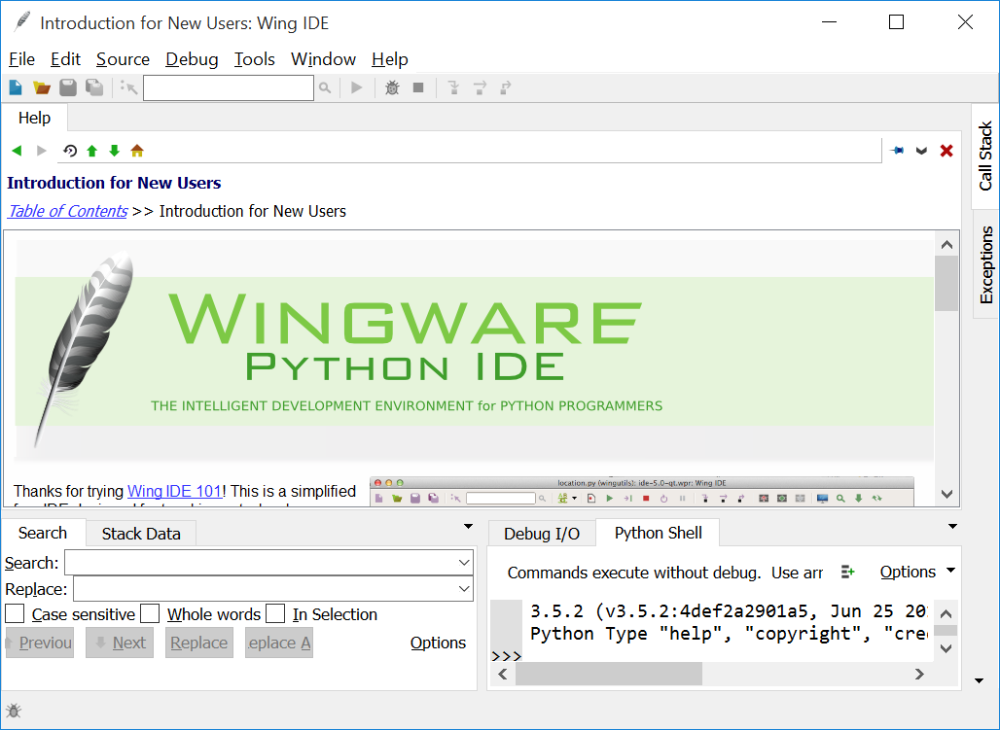
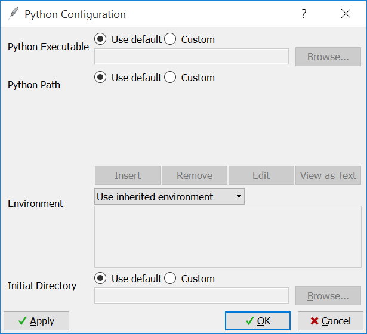
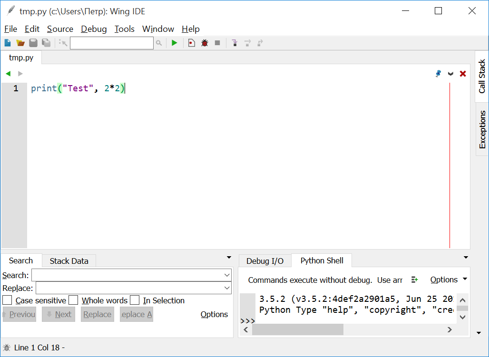
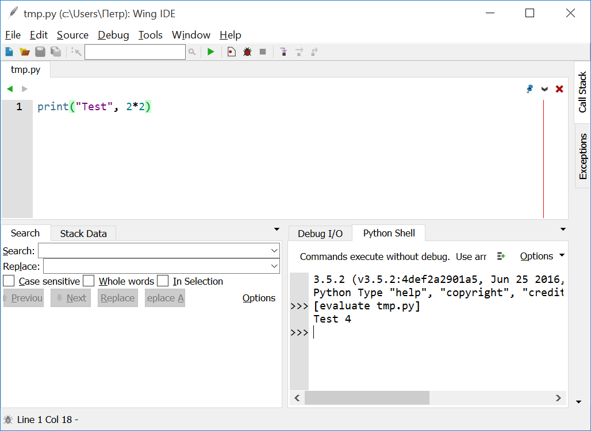

.. highlight:: python

Getting started in Python 3 and Wing IDE 101
=======================================

About Python versions
---------------------

Currently there are two main branches (versions) of Python language: Python 2 and Python 3.
Version 2 is officially considered deprecated (its support ends in 2020), version 3 is
newer and more modern. We will study exactly the version 3. Version 2 is significantly
different from version 3, and we will not discuss these differences here.

There are "sub-versions" within both version 2 and version 3. For example, the latest
version in the third branch now (2020) is 3.8.2 (besides those ones that are still
in development). Basically, for our lessons you can use any version of Python
from the third branch, preferably at least 3.3, but if there are no special reasons,
install the latest available version.

Installing Python
----------------

Python is a free cross-platform software, so it can be easily downloaded from
the official website, can be freely distributed, and can be installed on all
modern operating systems.

To install Python for Windows, download the installer from the course page or
from the official website (http://python.org, choose Downloads section;
make sure you are downloading exactly Python 3 for Windows). Install Python
using this program, there is nothing complicated in the installer. It's useful
to install Python somewhere in the root of the disk, such as ``C:\Python3``,
not in the folder suggested by default. To do this, select something like
"Customize install" and specify the necessary path on one of the following steps.

If you are working on another operating system, figure out how to install Python yourself. 
In Linux, for example, Python is included in the repositories of all leading distributions,
the package is usually called ``python3`` (and just ``python`` is the python
of the second version).

Installing Wing IDE
------------------

Python itself is only a code interpreter. It runs your programs, but doesn't contain a
convenient editor. Therefore, to write programs I advise you to use a integrated
development environment (in fact, an advanced editor) Wing IDE.

Unfortunately, Wing IDE is not a free software, but it has an official free version
for educational purposes, called Wing IDE 101. It's available for Windows, Linux and macOS.

All installation programs can be downloaded from the official Wing IDE website
(http://wingware.com /, via Download — Wing IDE 101); the installer for Windows
can also be downloaded from the course page. Please note that you need exactly
version 101, not any other! Install Wing IDE using this installer, there is nothing
complicated in it.

Wing IDE is just a *development environment* (IDE) for Python, i.e. a convenient program 
editor that allows you to easily run programs using Python (that's why you need
to install Python itself separately — Wing IDE doesn't include it). Basically,
you can use some other IDE, but then deal with it by yourself. In particular, Python itself
includes a simple development environment called Python IDLE. You can find its description
in many Python books, but it's too simple and therefore not very convenient.
There is also a popular IDE PyCharm, but for my taste, it's too complicated.

Checking the installation
-------------------------

Launch the Wing IDE. The following window will appear:

First, make sure that in the lower right corner, on the panel entitled Python Shell,
a text similar to the one shown in the figure appeared; in particular, the Python version
that you installed should be shown there. Make sure it's version 3 (in the picture
it's version 3.5.2). If this is not, then try using the ``Edit — Configure Python`` 
menu option to specify the path to Python manually (see the picture below) — in
"Python Executable" field, you need to type something like ``C:\Python3\python.exe``
if you have installed Python in the directory ``C:\Python3``. Perhaps you also should 
add ``C:\Python3`` to the ``Python Path`` list. You may have to explore it to find
the right settings. If you have both versions of Python installed on your computer 
(both 2 and 3), perhaps the Wing IDE will "pick up" Python 2 by default. 
In this case, also manually specify that you need to work with version 3.

If you fail, write to me [1]_, pointing where you installed Python and sending screenshots
of the main Wing IDE window and the ``Edit — Configure Python`` dialog.

The first program
----------------

In the main menu of the Wing IDE, select ``File — New``. A window for editing
the text of the program will appear. In this window, type the following text:

::

  print("Test", 2*2)

(Here ``"`` is a quotation mark.)

It should turn out like this:

Make sure there are no typos. Save the program: press Ctrl-S or select the menu option
``File — Save As``. Wing IDE will prompt you to choose a file name to save,
for the first program you can choose any name.

.. note::

    Note that the Wing IDE colors your program. This is done in order to make it easier to
    read. In fact, for Python the color is not important, it is made only for convenient
    reading. Similarly, in this text the code is also colored, moreover, the coloring may be
    slightly different (this is simply due to the system I use to write the text).
    But once again: the colors are for readability only, they don't carry any more sense.
    In particular, Wing IDE may color it differently than you see in this text — it's okay,
    there's nothing wrong.

After that, run the program by clicking on the button with a green
triangle arrow on the toolbar above the program text. The result of the program execution
will appear in the lower right part of the screen, on the "Python Shell" panel.
Namely, there you can see one of the two possible results shown in two figures below.

If there is an inscription "Test 4":

then everything is fine, the program has been successfully executed.

If there is a long text with the words "Traceback" (at the beginning) and
"Error" (at the end):

.. image:: ../python_basics/0_quick_start/wing_ide_3.png

then there are errors in your program. Read more about the errors below
(section :ref:`sec:ce`), and in the meantime, if you see an error,
just carefully check if you made a mistake somewhere when typing the program.

Make sure that your program works successfully (by carefully checking if you've made
any mistakes), and see what exactly is written in the "Python Shell" window. There, first,
you can see the Python header(including the version number), then the line
``>>> [evaluate tmp.py]`` (instead of ``tmp.py`` there will be the name of the file
where you saved the program). This line was printed at the moment when Wing IDE
started running your program. And finally, there is the line `Test 4`,
which was printed by the program.
Below we'll discuss why it printed exactly this.

Restart the program (green arrow) a few more times and look at the results.
You will see that the Wing IDE every time prints the string ``evaluate...`` 
before the program starts, then the program prints its own line. The output
of the program is mixed with the output of the Wing IDE — it's okay.

You can also run the program by clicking on the button with a picture looking
like a red bug. This is a slightly different execution mode which is 
more convenient for seeking errors. Try to start both this and that way 
and look at the differences (the main difference so far is that when you start
via the "red bug", the output of previous programs is overwritten).

.. _sec:ce:

Errors in the program
----------------------

Your program may contain serious errors — so that Python "does not understand" 
what you want from it (or maybe not so serious — the program works seemingly fine,
but the result is wrong). In case of such serious errors, Python will show 
a message similar to the one in the figure above. It usually starts with the word
"Traceback", and towards the end there's the word "Error".

It's more convenient to deal with errors by running the program in the "red
bug" mode. In this case, Wing IDE highlights the line near the error
in red, and writes detailed information in a special window on the right.

For now, it will be important which line was highlighted in red by the IDE — the error is 
approximately there. The text ("error message") is also important, usually containing 
the word "Error" (in the example in the figure ``Syntax Error ...``), the number of the
faulty line (``line 1``) is also there. At first, error messages are difficult
to understand, but over time you will learn the most common ones and 
immediately get what is wrong.

In the meantime, look carefully at the line with the error (when running through
a "bug", python highlights it in red, when running through an "arrow", it only writes
the line number) and at the surrounding lines — and try to understand what's wrong.
In the example in the figure, I forgot the second "2" number (as a result, 
it became unclear to the Python what to multiply the first one by).
(In the example in the figure, I ran the program through the "green arrow", and not
through the "red bug", so there is no line highlighted in red.)

Keep in mind that Python is not a telepath and cannot pinpoint exactly where you
made a mistake. It highlights the line where the program text first diverged 
from the language rules. Therefore, it happens that in fact your error is 
slightly above the highlighted line (and sometimes it is far above).
But nevertheless, the place highlighted by Python is usually useful
when you're searching for the error.

Try to make different mistakes in your program and see how Python reacts to them.

How this program works
----------------------
Let's take a look at how this program works. Let me remind you of its text:

::

  print("Test", 2*2)

In general, any program is, first of all, a sequence of instructions that the programmer
gives to the computer, and the computer consistently (one by one) executes them.

In our program there's an only instruction: ``print("Test", 2*2)``. The instruction
``print`` means "display" (show on the screen). In brackets after the word ``print``,
the *arguments* of the instruction are set. They are separated by commas. Here, 
the instruction has two arguments: the first is `"Test"`, and the second is `2*2`.

If the argument of the ``print`` instruction is some string enclosed
in quotes (``"`` characters), then ``print`` outputs this string on the
screen as is (without quotes). Therefore, the first thing our instruction displays
on the screen is the text ``Test``.

The second argument of the ``print`` instruction in our example is
the arithmetic expression ``2*2``. If the argument of an instruction (any of them, 
not necessarily `print`, we just don't know the others yet) is an arithmetic expression,
the computer will first calculate it, and then will pass it over. Therefore, in this case,
the computer will first calculate :math:`2\cdot 2`, get 4, and then pass the result to the 
instruction ``print``, which will display it on the screen.

``print`` separates the output elements with spaces, so between
``Test`` and ``4`` there's one space.

As a result, our program outputs ``Test 4``.

Using Python as a calculator
----------------------------

So, you can use Python as a calculator. For example, if you need to calculate
the value of the expression :math:`7+3\cdot(8-2)`, you can
write ``print(7+3*(8-2))`` and run the program — the result will be displayed
on the screen. Note that the brackets will be taken into account correctly\
and the order of calculations will be right. There are two brackets at
the end of the instruction — the first one is a part of the expression,
and the second ends the list of arguments of ``print`` instruction.

You can use the following operators in arithmetic expressions:
- `+` and `-` — addition and subtraction (including what is called
*unary* minus for writing negative numbers: to write
:math:`2\cdot(-4)`, you need to type ``2*(-4)``);

-   ``*`` — multiplication;

-   ``/`` — division ("fair", for example :math:`5/2=2.5`);

-   ``//`` (two ``/`` characters in a row) — Euclidean division (see below);

-   ``%`` — remainder (see below).

-   Brackets (round only) are used for grouping operations. You can
    use nested brackets, for example, `2*(3-(4+6))`.

A little more about the division. There are three operators related to division:
one operator for regular division (``/``), and two operators for Euclidean division
(division with remainder) (``//`` and ``%``). Remember the primary school and the division
with remainder: 16 divided by 3 will give the quotient 5 and the remainder 1.
Here `//` calculates the integer quotient, and ``%`` gives the remainder. It is written
like this: ``16 // 3`` and ``16 % 3``, as if ``//`` and `%` were the operation symbols,
like plus or asterisk. (Space around ``//`` and ``%`` are not required, but in Python
they're traditionally put there.)
(When operating with negative numbers, the result may seem unexpected to you. 
We will discuss this later.)

Furthermore, there are so-called *functions*:

-   The notation `abs(-3)` means taking the absolute value of the number: :math:`|{-}3|`.
    Please note that first *the name of the function* is written (in this case
    ``abs``), and then in brackets — what to apply this function to (of what number to
    take the absolute value in this case). What is in brackets is also called the *argument of the function*.

-   Similarly, the notation ``sqrt(4)`` means taking the square root
    (if you don't know what it is, then skip this point for now), but,
    since this operation is needed somewhat less often, in order to
    to use it, at the beginning of the program you need to write a magic string
    ``from math import *``. The program will look, for example, like this:

::

    from math import *
    print(sqrt(4))

All these operations can be combined. For example, an instruction
``print( (20 * 3) + sqrt( 2 + abs(5 - 7) ) )`` will output the value
of the expression :math:`20\cdot 3 + \sqrt{2+|5-7| }`. Plenty of spaces are put
into the code to make it easier to read; in general, in Python spaces can
be typed in any reasonable place (you can't put them inside numbers and names 
of the instructions but near brackets, punctuation marks and other symbols you can) 
but it is recommended to put them at least around the arithmetic operators.

Multiple expressions can be evaluated in one program. For example, the program
::

    print(2 * 2, 2 + 2)
    print(3 * 3)

evaluates three expressions. The first ``print`` displays two
fours separated by a space. The second ``print`` just outputs a single number
9. It will be output on a separate line, because each ``print`` instruction
outputs one line. Note again that the instruction arguments are separated by commas.

You can also, as we saw earlier, mix text (in quotes) and arithmetic expressions:
::

    print("Two by two is", 2 * 2, ".")

The basic input and output. Variables
----------------------------------------

It's not really interesting to write programs that always output the
same thing. We'd rather want the program to request something from the user and
run taking into account what the user has entered. For example, let's
write a program that will ask the user for two numbers and
display their sum on the screen.

But for this we need to learn one more important thing. When
a user enters two numbers, the program needs to remember them somehow, so
that it can then add them up and display the result on the screen.
To do this, in the computer there's memory (RAM). The program can use this memory 
and put the numbers entered by the user there. And then see what lies there,
add these two numbers, and display the result on the screen.

In many programming languages, in order to use memory, you need to use a set of
specific instructions. In Python, the approach is different: Python is smart enough 
to guess by itself that you need memory. Let's write the following program:
::
    a = input()
    print("You entered ", a, "!")

Before we discuss what does this code mean, type this the program 
and try to run it. First, run via the "green arrow". A line ``[evaluate ...]``
will appear in the Python Shell window. After that the cursor will blink, 
and at the top of this window there will be an inscription 
"Waiting for keyboard input". Enter something in this window and press
Enter. You will immediately see that what you have entered is displayed
on the screen in another line, with additional words ("You have entered"), additional
spaces and an exclamation mark. This is exactly what the program does: it displays what
you enter to it, adding more text.

If you run the program via a "red bug", everything will be the same.
The only change is that you will need to enter the text in an empty "Debug I/O" window,
which will appear instead of the "Python Shell" window.

Now let's look at how this program works.

The ``input()`` instruction means "wait until the user enters
something from the keyboard, and remember what he entered". But just
asking to "remember" is pretty useless, because after that we will
have to somehow tell the computer to recall what it remembered.
So we type ``a = input()``. This means "Remember what the user entered,
put it in memory, and from now on we will call this place in memory
the letter ``a``". Accordingly, the instruction ``print(a)`` means
"look at what's stored in memory in a place that we call the letter ``a`` 
and display it on the screen". And ``print("You entered ", a, "!")``
means "print first the phrase ``You entered``, then what lies in ``a``, 
then an exclamation mark, and divide it all with spaces."

Note that ``a`` is written without quotes. If we had typed 
``print("You entered ", "a", "!")``, Python would just output 
the letter ``a`` (as well as the rest of the text), it wouldn't understand
that we need it to output what lies in the memory part named ``a``.

These "places in computer's memory" are called *variables*. We will say:
"variable ``a``". And also: in the first line, we read what the user 
entered from the keyboard, and wrote it to the variable ``a``. And in
the second line we read what was written in the variable ``a``, and put
it on the screen.

You can create several variables in the program. The simplest sample
may look like this:
::
    a = input()
    b = input()
    print(b, a)

This program reads two lines that the user enters and
outputs them in reverse oreder: first the second, and then the first.

But we wanted a program that outputs the sum of two numbers.
A simple approach won't work here:
::
    a = input()
    b = input()
    print(a + b)

This code will do absolutely not what you might expect: Python believes yet 
that in ``a`` and ``b`` any strings can be stored. It doesn't understand you
meant numbers.

To explain that you meant numbers, you need to write it like this:
::
    a = int(input())
    b = int(input())
    print(a + b)

We use a new instruction (more exactly, a function) ``int``. It means:
take the result of the ``input()`` (i.e. the line that
the user enters), and turn it into an integer number. 
For now it's not necessary to fully realize this. 
Just remember that in order to input one number, you need
to type ``... = int(input())``, where the ellipsis should be replaced
with the name of the variable the result should be written to.

Run this program. In the input window, type a number and press Enter.
Then type the second number and press Enter again. You
will see that the program printed their sum.

If you try to input two numbers in one line (i.e. type "2 Space 3 Enter"), 
the program will terminate with an error. Indeed:
you asked it to convert the string "\``2 3``\" into a number (single number!) and
write it to the variable ``a``, but this is, of course, not 
a correct recording of a single number.

To enter numbers separated by space, you need to use a different construction:
::
    a, b = map(int, input().split())

For now this is a kind of magic that you'll have to learn by heart. Later
you'll understand what it means here. Note that there are no brackets after ``int``
, but there are after ``input`` and ``split``.

Using this method, you can enter as many numbers as you want; for example, to input four
numbers in one line, you need to write
::
    a, b, c, d = map(int, input().split())

You don't have to call variables ``a`` and ``b``. To give a name to a variable
you can use almost any string of English letters and numbers (there are 
some exceptions, but it's not so important yet). For example, you could 
call variables ``first`` and ``second``, or ``x1`` and ``x2``, etc. 
Of course, you can create as many variables as you need; 
in general, variables are the main things programs work with.

And a few more remarks on our program. First, this program did not
display any "prompts" like "Enter a and b". Python is not going
to do anything for you. If you really want the program to display 
this message on the screen, then do so: type ``print ("Enter a and b")``. 
But we will not print such invitations in our programs. We will assume that
the user himself knows exactly what is required of him. In the problems you
will be asked to solve, it will be stated clearly what needs to be output
to the screen — and no extra messages should be displayed.

Assignment
----------
So far, we only know how to write to variables what the user entered from 
keyboard. In fact, it is much more common to write to our variables
values that the program calculates itself. There is
a special instruction for this, which is called *assignment*
(and in fact we've already seen her):
::
a = 10

It means "to the variable ``a`` write 10".

On the right of the equality sign you can write any expressions 
(for example, ``a = 10 + abs(5 - 9)``). Moreover, you can also
use other variables which some values are already assigned to. 
For example, the program
::
a = 20
b = a + 10
print(b)

will output 30, because first 20 is written to ``a``, then
the computer looks at what is written to ``a``, adds 10 and
writes the result to ``b``. Then it looks at what is written 
to ``b`` and displays it on the screen.

If some value was already assigned to the variable, then upon
a new assignment the old value is being overwritten:
::
    a = 20
    a = 30

as a result, ``a`` is 30, and 20 is completely forgotten.

A special interesting option is that on the right you can use 
the same variable that is on the left — and then its previous 
value will be used:
::
a = 20
a = a + 10

This means "Write 20 to ``a``. Then look at what is in ``a``,
add 10 to it and write the result back to ``a``". As a
result, value of ``a`` will become 30.

That instruction ``a = input()`` we saw earlier is actually also
an assignment. It says: "read what the user entered
from the keyboard, and write it to ``a``".

On the left of the equality sign you can type several variables 
separated by commas. Then there should also be several 
comma-separated values on the right (or special functions 
like the already mentioned ``map``, but for now 
we will not discuss them in detail):
::
a, b = 10, 20

It means "to ``a`` to write 10, to ``b`` write 20".

The notation ``a = 10`` should be read "assign 10 to the variable ``a``", 
or more compact "assign 10 to ``a``". Do not say "``a`` is equal to 10" 
because ``is equal`` is not an imperative, and it is not clear
what action is being performed. Moreover, if the entry ``a = a + 1``
is read with "equal", then it turns to "``a`` is equal to ``a`` plus one", 
which does not look like an instruction at all, but rather an equation that has
no solutions. Therefore, say "assign", not "equal".

There are also a number of useful instructions that combine 
arithmetic operation and assignment (they're called 
augmented assignment operators). For example, ``a += 10`` stands for 
``a = a + 10`` ("increase ``a`` by 10"). You can do the same 
with the rest of the arithmetic operations: ``a /= 5`` means ``a = a / 5``,
``a %= 5`` means ``a = a % 5``, etc.

Comments in the code
--------------------
(You may not need this information right now, but it will be useful when reading further sections.)

You can leave *comments* in your programs. That is, if the symbol 
"grid" (``#``) is typed somewhere in the program, then this symbol 
and everything that follows it to the end of the line
is completely ignored by Python interpreter. Thus, you can leave notes 
in the program for yourself or for other programmers 
who will read your program. For example:
::

a = int(input()) # reading one number

Here the inscription ``# reading one number`` is completely ignored by Python, 
as if these characters do not exist at all,
and ``a = int(input())`` works as it should.

In particular, the grid can be at the beginning of the line, 
then this whole line will be ignored:
::
# to begin with, we read the number
a = int(input())

Python does not care where and how you leave comments,
you leave them only for yourself or for other people 
who will read your program. In the simplest programs
comments are usually unnecessary, and you won't need them 
at first, but I will use them in further sections
of this course to explain code snippets.

Programming language as a constructor
-------------------------------------

Above I have described some of the most basic constructions 
of Python language. Now your task will be to assemble programs 
from these constructions, as from a construction toy like Lego.
Treat it exactly like a construction set: all programming is 
the assembly of large programs from separate statements and expressions.

Sample problems and solutions
-----------------------------

Here are a few sample problems similar to ones you may come across on contests and in my course.

.. task::

    Vasya bought :math:`N` muffins and Masha bought :math:`K` muffins more.
    What is the overall amount of muffins they bought?

    **Input**: On the first line there's an only number :math:`N` and on the second line an only number :math:`K`.

    **Output**: One number — the answer to the question of the problem.

    **Example**:

    Input::

        4
        2

    Output::

        10
    |
    |
    |

Well, first of all, we need to read the data. Two numbers are entered 
on two separate lines, so they we can read them like this::

    n = int(input())
    k = int(input())

Then we need to understand how the answer is calculated. In this problem, 
it's easy to guess that the answer is just math:`2\cdot N + K'. So we print it::

    print(2 * n + k)

The whole program will look so::

    n = int(input())
    k = int(input())
    print(2 * n + k)

It's also possible to do it in another way: after reading the data, 
first calculate separately how many muffins Masha bought::

    m = n + k

and after that output the answer as the sum of ``n`` and ``m``::

    n = int(input())
    k = int(input())
    m = n + k
    print(n + m)

One more alternative way is to save the answer to a variable, 
and only then output it. For example, like this::

    n = int(input())
    k = int(input())
    ans = 2 * n + k
    print(ans)

All of these ways are correct, and it is quite easy 
to come up with a number of other correct solutions.

.. task::

    :math:`N` minutes have passed since the beginning of the day. 
    Determine how many hours and minutes an electronic clock 
    will show at this moment. It is guaranteed that :math:`N` is 
    less than 1440, i.e. that less than a full day has passed.

    **Input**: An integer number :math:`N`.

    **Output**: Print the answer to the problem.

    **Example**:

    Input::

        150

    Output::

        2 30
    |
    |
    |

Here, again, we need to figure out what mathematical formula 
gives the solution. If it's not obvious right away, then think about it: 
how would you solve the problem yourself for a certain input?
For example, 150 minutes have passed since the beginning of the day 
— how do you know how many hours and how many minutes it is?

After thinking a little, it becomes clear that we need to divide 
math:`N` by 60 (the number of minutes in an hour) with the remainder,
so the quotient will be just the number of hours 
and the remainder will be the number of minutes.
Accordingly, we write it::

    n = int(input())
    print(n // 60, n % 60)

As in the previous task, we could also optionally save 
the answers to variables.

.. task::

    Masha needs to buy :math:`A` large beads, :math:`B` medium
    and :math:`C` small. One large bead costs :math:`X` rubles, 
    the medium one is :math:`Y` rubles, the small one is :math:`Z` rubles.
    How many rubles will Masha spend in total? 

    **Input**: On the first line there are three numbers: :math:`A`, :math:`B` and :math:`C`.
    On the second line also three numbers: :math:`X`, :math:`Y` and :math:`Z`.

    **Output**: One number — how many rubles Masha will spend.

    **Example**:

    Input::

        3 2 1
        6 5 4

    Output::

        32
    |
    |
    |

Clearly, the answer to the problem is: :math:`A\cdot X + B\cdot Y + C\cdot Z`.
All that's left is only to process the input and output accurately. 
Here two lines of three numbers are given,
so we need to input the data twice through `map(int(...`::

    a, b, c = map(int, input().split())
    x, y, z = map(int, input().split())
    print(a * x + b * y + c * z)

.. task::

  The car is going at a speed of :math:`N` kilometers per hour.
  Output this information as follows: "The speed is :math:`N` kmph.", 
  substituting the entered number instead of :math:`N` (see the example).

    **Input**: One number :math:`N`.

    **Входные данные**: Print a line.

    **Example**:

    Input::

        55

    Output:

    .. code-block:: text

        The speed is 55 kmph.
    |
    |
    |

Reading a number, I think, shouldn't be a problem, 
but for output it is necessary to remember
that you can print not only numbers, but also strings::

    n = int(input())
    print("The speed is", n, "kmph.")

What's next?
-----------

(Certainly, this section is only for students of my course.)

First, if you haven't done this yet, read all the texts 
in the header on the course page, especially the section 
"How to work with the site...", then start doing 
"Arithmetic operator problems". And move on.

**Attention!** Do not read the following sections of this text right now,
do not click the "Next" button below. There is the theory on the new topics,
so first do the problems on arithmetic operations on the site, and only
then move on to those topics (by the links on the site).

And in case of any questions, write to me.

.. [1] Of course, the suggestions "write to me" are only referred to students of my course.
