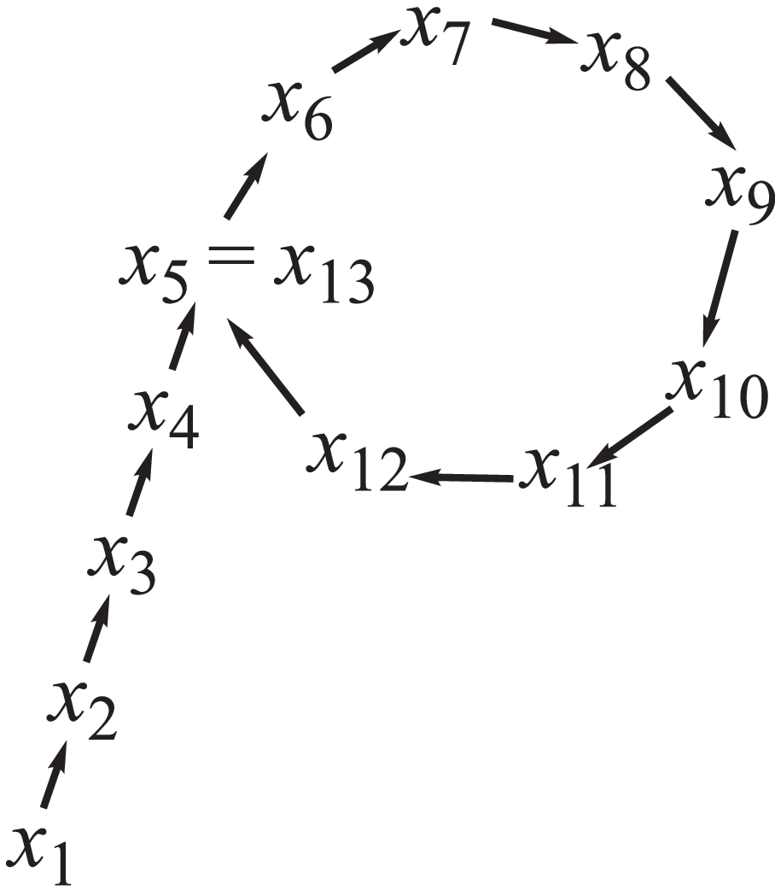

Поиск зацикливания в последовательности
---------------------------------------

Пусть у нас есть последовательность, в которой каждый член может
принимать одно из :math:`M` значений и является однозначной функцией
предыдущего члена. Т.е. :math:`x_1` задано, а

.. math:: x_{i+1}=f(x_i),

где :math:`f` — некоторая (известная нам, конечно) функция; причём
количество возможных значений для каждого члена последовательности есть
:math:`M` (т.е. :math:`f` — это функция, которая в качестве своего
параметра принимает одно из :math:`M` допустимых значений и возвращает
ещё какое-то из этих же значений). Например, :math:`f(x)=x^2 \bmod M`.
Очевидно, что все члены (начиная со второго точно) будут целыми числами
от 0 до :math:`M-1`.

Тогда очевидно, что у последовательности будет какой-то период, т.е.
начиная с некоторого места значения элементов последовательности начнут
повторяться. В общем случае возможен также и предпериод. Например, если
:math:`f(x)=x^2 \bmod 7` и :math:`x_1=3`, то последовательность будет
иметь вид 3, 2, 4, 2, 4…Видно, что есть период — 2, 4; и предпериод — 3.
В общем случае, конечно, и предпериод, и период могут быть разной длины;
очевидно только то, что их суммарная длина не превосходит :math:`M`
(т.к. первое повторение должно будет произойти максимум на
:math:`(M+1)`-м числе). Везде в будущем я буду обозначать :math:`l` —
минимальная длина предпериода, :math:`p` — минимальная длина периода.
Замечу, что тогда периодами будут :math:`p`, :math:`2p`, :math:`3p` и
т.д., а предпериодами можно считать и :math:`l`, и :math:`l+1`, и
:math:`l+2` и т.д.

Т.е. общая картина будет такая: мы сначала двигается по некоторым числам
(по предпериоду), а потом выходим на цикл. На рисунке ниже пример для
:math:`l=4`, :math:`p=8` (т.е. :math:`x_5=x_{13}`, :math:`x_6=x_{14}`, и т.д.)

|image|

Часто нам бывает нужно найти длины периода и предпериода нашей
последовательности. Например, нам на самом деле надо найти член
последовательности с очень большим номером :math:`N`. Тогда, найдя
период и предпериод, нам не надо будет вычислять последовательность до
:math:`N`-ого члена, а достаточно будет знать остаток от деления
:math:`N` на период.

.. task::

    Додумайте тут все оставшиеся детали, т.е., как, зная период,
    предпериод и :math:`N`, найти :math:`N`-й член последовательности. Не
    забудьте про существование предпериода: а именно, как про то, что
    :math:`N` может оказаться меньше длины предпериода, так и про то, что
    период начинается не с первого члена.
    |
    |
    |

Обычно нам не надо знать *минимальные* период и предпериод; достаточно
знать хоть какие-нибудь (но не слишком длинные). Например, если в
вышеприведённом примере мы сочтём, что у нас период есть 4 2 4 2, а
предпериод — 3 2 4 2, то это обычно не страшно (например, в задаче
нахождения :math:`N`-ого члена последовательности это очевидно не
страшно). Мы сосредоточимся именно на задаче поиска *каких-нибудь*
периода и предпериода; в конце я ещё скажу на эту тему.

Замечу ещё один момент: пусть вы можете обратить функцию :math:`f`, т.е.
выразить :math:`x_i` через :math:`x_{i+1}` следующим образом:
:math:`x_i=f'(x_{i+1})` с некоторой (новой) функцией :math:`f'`, или,
что на самом деле то же самое, что для каждого значения :math:`x`
существует единственный его «прообраз» :math:`x'` такой, что
:math:`f(x')=x`. Тогда это обозначает, что по последовательности вы
можете двигаться в обе стороны (т.е. по данному элементу находить как
следующий, там и предыдущий), и это значит, что у неё нет предпериода.
Действительно, рассмотрим самое первое число, входящее в периодическую
часть. Тогда у него есть два предшественника: последнее число
предпериода и последнее число периода (т.к. после последнего числа
периода опять идёт первое число периода). Эти два числа различны (иначе
наше число не было бы самым первым числом периода), что противоречит
тому, что по числу однозначно определяется его предшественник. То же
самое можно сказать по-другому: начнём с какого-то числа в периоде и
будем двигаться назад. Т.к. мы все время можем однозначно определять
предыдущее число, то ясно, что и двигаясь назад, мы по этому периоду
будем мотаться до бесконечности и никогда ни в какой предпериод не
вывалимся (равно как двигаясь вперёд, мы никогда не вывалимся из
периода). То же самое: это обозначает, что на рисунке, изображающем нашу
последовательность (как рис. выше) мы можем обратить стрелки, и из
каждого числа тогда будет выходить не более одной стрелки. Картинка с
предпериодом очевидно этому не удовлетворяет.

Поэтому в таком случае вы можете искать период очень просто: просто
вычислять один за другим элементы последовательности и смотреть, когда
повторится *первый* элемент. А повториться он обязан, т.к. вы с самого
начала находитесь в периоде.

Но далее мы рассмотрим более общий случай, т.е. когда не очевидно, что
предпериод отсутствует. Как найти какой-нибудь период и предпериод?
Можно поступить по-тупому, просто запоминая в каком-нибудь массиве,
какие элементы уже встречались, и на очередном элементе проверять, не
встречался ли он раньше. Или проще: завести массив размера :math:`M` и в
нем в соответствующих элементах помечать, какие члены последовательности
уже встретились.

Но это требует или памяти :math:`O(M)` (если на каждый элемент заводить
свою ячейку массива), или памяти :math:`O(l+p)`, но долгого времени,
если на каждом шагу искать среди уже встреченных элементов наш. Мы же
будем строить алгоритмы поиска периода, требующие :math:`O(1)` памяти и
:math:`O(l+p)` времени. Я знаю два способа, которые и изложу ниже.

**Первый способ: Указатели с разными скоростями.** Заведём два указателя
на элементы нашей последовательности и будем ими двигаться по ней. (Что
я тут имею ввиду под указателями? Конечно, не ``pointer`` и т.п., а
просто переменную, в которой будем хранить значение очередного элемента
массива.) При этом за один шаг будем сдвигать первый указатель на одну
позицию, а второй — на две:

::

    a:=x1;
    b:=x1;
    i:=0;
    repeat
      a:=f(a);
      b:=f(b);
      b:=f(b);
      inc(i);
    until a=b;

Как это работает? За один шаг расстояние между элементами :math:`a` и
:math:`b` увеличивается на единицу. Как только выполнятся сразу два
условия: элемент :math:`a` вылезет за предпериод (т.е. попадёт в период;
элемент :math:`b` идёт впереди элемента :math:`a`, поэтому к этому
моменту :math:`b` уже точно будет в периодической части) и расстояние
между :math:`a` и :math:`b` станет кратным периоду :math:`p`, то тут же
условие выхода из цикла выполнится и будет найдены период и предпериод:
в качестве длины и того, и того можно взять :math:`i`: оно всегда равно
расстоянию между :math:`a` и :math:`b` и равно количеству элементов от
начала последовательности до :math:`a`.

Если вам до сих пор не понятно, как так получилось, что, если условие
выполнилось, то в качестве длин периода и предпериода можно взять
:math:`i`, то продумайте это ещё раз. Можете посмотреть на примерах. Не
забудьте, что мы ищем какой-нибудь предпериод, а не кратчайший.

Осталось только понять, что это работает за :math:`O(l+p)`. А это
очевидно. За время :math:`O(l)` элемент :math:`a` доползёт до
периодической части (пройдя весь предпериод), а далее не более чем за
:math:`O(p)` шагов расстояние между :math:`a` и :math:`b` доползёт до
числа, кратного :math:`p`. Действительно, за один шаг оно увеличивается
на единицу, поэтому ползти до числа, кратного :math:`p`, оно будет типа
:math:`p-r` шагов, где :math:`r` есть остаток от деления на :math:`p`
расстояния между ними в момент выхода :math:`a` в период. Значения,
кратного :math:`p` оно не проскочит, т.к. за один шаг увеличивается на
единицу. Значит, действительно это работает за :math:`O(l+p)`.

.. task::

    На первый взгляд может показаться, что надо бы делать проверку
    :math:`a=b` два раза за цикл: после каждого увеличения :math:`b`:
    
    ::
    
        ...
          a:=f(a);
          b:=f(a);
          if a=b then break;
          b:=f(a);
        ...
    
    типа того (т.е. и соответственно исправить подсчёт длин периода и
    предпериода), чтобы не получилось так, что :math:`b` «перескочит» через
    :math:`a`. Поймите, почему этого можно не делать.
    |
    |
    |

**Способ 2:** :math:`\rho`\ **-эвристика.** На самом деле
:math:`\rho`-эвристика — это весьма интересный алгоритм поиска делителей
у больших чисел, использующий поиск зацикливания в последовательности и
изложенный в том числе в Кормене. Но (по крайней мере в версии
алгоритма, изложенной в Кормене) там используется другая идея поиска
зацикливания в последовательности, которую я тут и изложу (а саму
:math:`\rho`-эвристику излагать тут не буду, она далеко не так интересна
:) ). Кстати, название :math:`\rho`-эвристики основано на схожести
картинки, приведённой выше (т.е. картинки зацикливания
последовательности) с греческой буквой :math:`\rho`.

Идея такая: возьмём все элементы последовательности, номера которых
являются степенями двойки (т.е. :math:`a_1`, :math:`a_2`, :math:`a_4`,
:math:`a_8`) и (мысленно) разобьём всю последовательность на кусочки,
начинающиеся с этих элементов:

.. math::

   a_1 | a_2 a_3 | a_4 a_5 a_6 a_7 | a_8 a_9 a_{10} a_{11} a_{12} a_{13} a_{14} a_{15} | 
   a_{16} a_{17} \dots a_{30} a_{31} | a_{32} \dots

Будем просматривать кусочки с первого и дальше, и в каждом сравнивать
все элементы с первым элементом последовательности (точнее, все, кроме
первого элемента кусочка; в частности, в первом кусочке нам нечего будет
делать). Точнее, будем просто двигаться по последовательности,
контролируя, в каком кусочке мы находимся и сравнивая текущий элемент с
первым элементом этого кусочка.

Как только найдём совпадение очередного элемента с первым элементом
кусочка, очевидно, что мы найдём период (а если подумать, то ясно, что
найдётся *кратчайший* период). Тогда предпериод можно взять равным
расстоянию от начала последовательности до начала текущего кусочка.

.. task::

    Попробуйте написать этот код сами. Я его приведу ниже, но
    постарайтесь как-нибудь написать его сами, прежде чем читать
    дальше.
    |
    |
    |

За какое время будет найден период? Ясно, что, чтобы нашёлся период,
необходимо выполнение двух условий: во-первых, надо, чтобы начала
текущего кусочка вылезло за предпериод, во-вторых, надо, чтобы длина
кусочка стала не меньше, чем :math:`l`. Первое произойдёт за
:math:`O(p)`, второе за :math:`O(l)`, Поэтому это работает за
:math:`O(l+p)`. (Действительно, когда длина периода превзойдёт
:math:`l`? Когда длина :math:`2^k` очередного кусочка превзойдёт
:math:`l`. Но тогда :math:`2^{k-1}<l`, значит, :math:`2^k<2l`, т.е.
:math:`2^k=O(l)`, и аналогично :math:`2^{k+1}=O(l)` и т.п. Если немного
подумать, то из таких соображений все следует.)

Итак, обещанный код (как я бы его написал; конечно, можно его и
по-другому писать). Только надеюсь, что вы сами сначала подумали над
ним.

::

    a:=x1;
    k:=1;
    i:=1;
    while true do begin
          if i=k then begin
             a0:=a;
             k:=k+k;
          end else if a=a0 then
              break;
          inc(i);
          a:=f(a);
    end;

Что я тут делаю? :math:`a` — текущий элемент, :math:`a0` — первый
элемент текущего кусочка, :math:`k` — номер начала следующего кусочка,
:math:`i` — номер текущего элемента. Я думаю, что в остальном код
понятен, если над ним немного подумать.

Конец :math:`\rho`-эвристики.

Итак, мы умеем искать период и предпериод, причём даже двумя способами.
Теперь ещё пара финальных замечаний. Во-первых, если мы нашли
*какие-нибудь* период и предпериод, то можно найти и *минимальные*.
Действительно, для начала мы сможем найти минимальный период. Очень
просто: начав с любого места внутри периода, будем идти до тех пор, пока
не встретится то число, с которого мы начали. Очевидно, что таким
образом мы найдём минимальный период :math:`p`. Далее, для нахождения
минимального предпериода, будем двигаться параллельно двумя указателями,
расстояние между которыми будет ровно :math:`p`. Т.е. сравним первый и
:math:`(p+1)`-ый элементы последовательности. Если они уже равны, то
предпериода, очевидно, нет. Иначе сдвинемся на единицу: сравним 2-ой и
:math:`(p+2)` элементы, и т.д., до тех пор, пока не элементы не
совпадут. Когда они совпадут, это будет обозначать, что оба указателя
вышли из предпериода, причём первый (тот, что указывает на меньший по
номеру элемент) вышел из предпериода только что. Таким образом, мы
найдём *минимальный* предпериод. Напоследок ещё раз замечу, что искать
минимальные период и предпериод надо далеко не всегда; в большинстве
случаев может быть достаточно *какого-нибудь* периода и предпериода.

Напоследок в качестве примера скажу о поиске периода в
последовательности остатков чисел Фибоначчи по данному модулю. А именно,
определим :math:`F_0=0`, :math:`F_1=1`,
:math:`F_{i+1}=(F_i+F_{i-1}) \bmod M`. Если у так определённой
последовательности :math:`F` период? Конечно, есть. Действительно, здесь
очередной элемент определяется *парой* предыдущих, поэтому как только
повторится пара, так начнётся период, но его длину можно оценить сверху
только числом :math:`M^2` (а не :math:`M`, как раньше). (Хотя
экспериментально оказывается, что для большого количества модулей длина
периода сравнима с :math:`M`.)

.. note::

    Более формально можно определить :math:`G_i=(F_i,F_{i+1})`, т.е.
    как пару из двух последовательных элементов последовательности. Теперь
    каждый элемент :math:`G_i` зависит только от предыдущего, но возможных
    значений элементов стало :math:`M^2`, а не :math:`M`, как раньше.

Кроме того, заметим, что по этой последовательности мы можем ходить в
обе стороны: :math:`F_{i-1}=(F_{i+1}-F_i) \bmod M`, поэтому предпериода
нет и мы с самого начала находимся в периоде. Поэтому можно искать
период, просто смотря, когда повторятся два числа 0 и 1 подряд.

