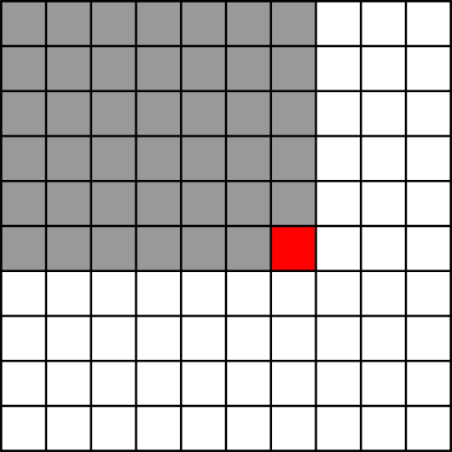

.. highlight:: python

Префиксные суммы и смежные темы
-------------------------------

Основное
````````

Рассмотрим массив :math:`a` из чисел. Создадим новый массив :math:`pref`, и заполним его
по следующим правилам::

    pref[0] = a[0]
    pref[1] = a[0] + a[1]
    pref[2] = a[0] + a[1] + a[2]
    pref[3] = a[0] + a[1] + a[2] + a[3]
    ...

Т.е. в :math:`i`-м элементе массива :math:`pref` храним сумму первых элементов массива :math:`a`, с нулевого по :math:`i`-й.

Этот массив назваается массивом *префиксных сумм*. (Префиксных — потому что префиксом называется любое начало массива,
например, :math:`(a[0], a[1], a[2])` — это префикс массива :math:`a`, и аналогично :math:`(a[0])` — это тоже префикс массива :math:`a`.)

Конечно, для его вычисления не надо писать два вложенных цикла. Надо просто обратить внимание, что :math:`pref[i] = pref[i-1] + a[i]`,
и поэтому массив вычисляется следующим образом::

    pref[0] = a[0]
    for i in range(1, n):
        pref[i] = pref[i - 1] + a[i]

Зачем этот массив может быть нужен? Ну, во-первых, бывают задачи, где вам надо часто использовать именно префиксные суммы. Тогда вместо того,
чтобы их считать заново каждый раз, вы заранее насчитываете массив таких сумм, и дальше используете их.

Но еще есть следующий, очень полезный, прием. Пусть нам надо посчитать сумму элементов с :math:`L` по :math:`R` включительно,
т.е. :math:`a[L] + a[L+1] + \ldots + a[R]`.
Несложно видеть, что она равна :math:`pref[R] - pref[L-1]`, надо только аккуратно обработать случай :math:`L=0`, чтобы не получить выход за пределы массива.
И всё, и не надо писать цикл от :math:`L` до :math:`R`. Это и есть основное применение префиксных сумм.

Нулевые элементы
````````````````

В примере выше было не очень удобно то, что вам надо особо рассматривать случай :math:`L=0`. Этого можно избежать, если немного поменять
определение префиксных сумм, а именно, если считать так::

    pref[0] = 0
    pref[1] = a[0]
    pref[2] = a[0] + a[1]
    pref[3] = a[0] + a[1] + a[2]
    pref[4] = a[0] + a[1] + a[2] + a[3]
    ...

Мы по сути сдвинули индексацию на единицу, теперь массив :math:`pref` имеет длину на 1 больше, чем массив :math:`a`.
Естественно, вычисляется такой массив полностью аналогично написанному выше циклу.
И тогда искомая сумма с :math:`L` по :math:`R` включительно равна просто :math:`pref[R + 1] - pref[L]`, и особых случаев нет.

На самом деле, такое определение очень естественно выглядит при сравнении с питоновскими срезами. У нас по сути получилось ``pref[i] = sum(a[:i])``.
И сумма среза ``sum(a[l:r])`` получается просто ``pref[r] - pref[l]`` (не забывайте, что срезы **не** включают правую границу, 
т.е. в отличие от написанного выше, тут ``l`` включительно, а ``r`` не включительно).

Суффиксные суммы
````````````````

Помимо префиксных сумм можно также рассмотреть *суффиксные* суммы — суммы *концов*, а не *начал*, массива. Примерно так::

    suff[n - 1] = a[n - 1]
    suff[n - 2] = a[n - 2] + a[n - 1]
    suff[n - 3] = a[n - 3] + a[n - 2] + a[n - 1]
    ...

С ними всё аналогично: их можно вычислить аналогичным циклом (только теперь цикл должен идти с конца), можно точно так же 
использовать для вычисления суммы на отрезке, будет особый случай ``R = n - 1``, ну и можно еще ввести ``suff[n] = 0``, и тогда 
особых случаев не будет, и будет верно, что ``suff[i] = sum(a[i:])``.

Префиксные/суффискные максимумы
```````````````````````````````

Можно вычислять не сумму, а произведение, НОД, максимум и т.д. Например, для префиксных максимумов::

    pref[0] = a[0]
    pref[1] = max(a[0], a[1])
    pref[2] = max(a[0], a[1], a[2])
    pref[3] = max(a[0], a[1], a[2], a[3])
    ...

Вычисляется такой массив, естественно, полностью аналогично: ``pref[i] = max(pref[i - 1], a[i])``.

Вычислять максимум на отрезке (т.е. максимум от :math:`L` до :math:`R`) это нам не особо поможет, потому что
для максимума нет аналога вычитания, мы не можем как-то «выкинуть» первые :math:`L-1` элемент, но префиксные максимумы могут быть полезны и сами по себе,
если в какой-то задаче вам надо много раз считать максимум на префиксе, то вы можете их посчитать один раз заранее.

Аналогично можно считать и суффиксные максимумы, произведения, НОДы и т.д.

Двумерные префиксные суммы
``````````````````````````

Аналогичную идею можно распространить и на двумерные массивы. В таком случае массив префиксных сумм, конечно, тоже будет двумерным,
и в ``pref[i][j]`` мы будем хранить сумму в первых ``i`` строках и первых ``j`` столбцах. Т.е. в массиве ``pref`` в ячейке, помеченной красным,
будем хранить сумму элементов массива ``a`` в ячейках, помеченных серым, и включая и красную ячейку:



Как вычислить эти значения? Тут не так просто, как в одномерном случае, но и не особо сложно. Если подумать, то становится понятно, что

::

    pref[i][j] = a[i][j] + pref[i-1][j] + pref[i][j-1] - pref[i-1][j-1]

Действительно, сумма ``pref[i-1][j] + pref[i][j-1]`` покрывает всю серую область (без красной ячейки), но проблема в том, что левую верхнуюю часть этой области
она покрывает два раза. Поэтому мы вычитаем ``pref[i-1][j-1]``, ну и прибавляем ``a[i][j]``, чтобы учесть собственно красную ячейку.
Осознайте это.

Такие префиксные суммы позволяют нам, например, вычислять сумму в произвольном прямоугольнике. Если координаты левого верхнего угла прямоугольника — :math:`(i1, j1)`,
а правого нижнего — :math:`(i2, j2)`, то сумма в этом прямоугольнике, как несложно видеть, будет равна

::

    pref[i2][j2] - pref[i1 - 1][j2] - pref[i2][j1 - 1] + pref[i1 - 1][j1 - 1]

Логика этой формулы полностью аналогично логике формулы пересчета массива ``pref`` два абзаца назад; осознайте эту логику.

Аналогично описанному выше, тут будут особые случаи, если :math:`i1=0` или :math:`j1=0`. Для этого, аналогично описанному выше, 
можно добавить дополнительные нулевые строку и столбец в начало массива ``pref``, сдвинув индексы на единицу, т.е. считать, что ``pref[i][j]`` — это сумма чисел в первых ``i-1`` строке
и первых ``j-1`` столбце::

    pref[i][j] = a[i - 1][j - 1] + pref[i-1][j] + pref[i][j-1] - pref[i-1][j-1]

и тогда сумма в нужном нам прямоугольнике вычисляется как

::

    pref[i2 + 1][j2 + 1] - pref[i1][j2 + 1] - pref[i2 + 1][j1] + pref[i1][j1]

без всяких особых случаев.
