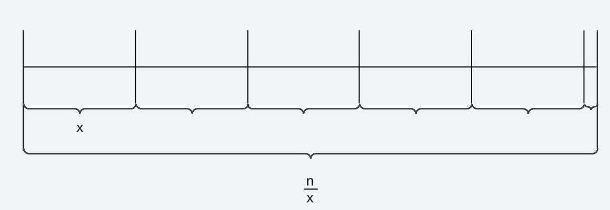
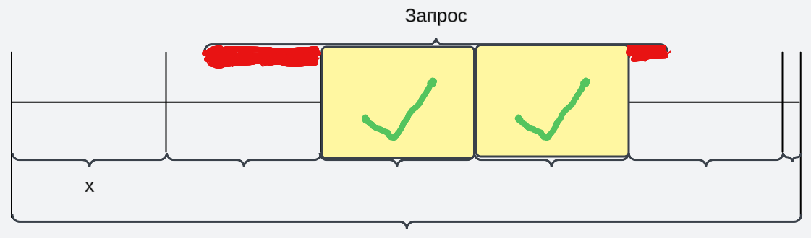

.. highlight:: cpp

Теорию подготовил Никита Данилов. Вопросы по этой статье можно писать мне в телеграм: https://t.me/nik_danilov.

Sqrt-decomposition(корневая эвристика) - это множество различных идей, имеющих схожую структуру. Чаще всего под sqrt декомпозицией имеют ввиду алгоритм на массиве, но есть также другие связанные с этим идеи. Благодаря sqrt декомпозиции обычно удаётся ускорить выполнение запросов от линейной ассимптотики до корня.

.. important::

	sqrt(N) - обозначает корень из числа N.
	
.. important::
	
	Для тех кто не знает разницу между map, unordered_map и gp_hash_table или вообще не знает про одно из них:
	
	map - структура которая автоматически сортируется, но это нужно довольно редко
	
	unordered_map - тоже является словарём, по нему также можно пройти, он работает гораздно быстрее map, но не сортируется.
	
	gp_hash_table - работает ещё быстрее чем unordered_map, кажется у неё всё те же функции, но она занимает чуть больше памяти.
	
	Чтобы её подключить, нужно написать в коде:

:: 
	
    // написать вместе с другими include в начале кода
    #include <ext/pb_ds/assoc_container.hpp>
    using namespace __gnu_pbds;
    // затем использовать также как map
    gp_hash_table<int, int> x;
    
	

Корневая на массиве
===================

Рассмотрим следующую задачу. Есть массив из `N` элементов. Даны `Q` запросов двух видов: изменение элемента массива и запрос суммы на подотрезке массива.

Если бы запросов суммы было мало, или они были бы на очень коротких отрезках, можно было бы тривиально менять элементы в массиве и суммировать подотрезки. Но в худшем случае это решение работает за `O(N * Q)`, а нам хочется делать это быстрее.

Если бы не было запросов изменения, можно было бы предподсчитать префиксные суммы и отвечать на запросы суммы при помощи них. Но после запроса изменения (например если запрос будет менять первый элемент массива), может понадобиться поменять до `N` элементов и ассимптотика снова будет `O(N * Q)`.

Чтобы ускорить работу кода, предподсчитаем суммы на некоторых блоках подряд идущих элементов. Тогда пусть длина блока x, тогда нам понадобится n / x блоков (возможно последний блок будет меньшей длины). 

Тогда при запросе суммы на подотрезке, мы сможем сложить несколько сумм, предподчитанных на блоках, и суммы на концах отрезка, не попавшие целиком ни в один блок, мы можем посчитать тривиально. Чтобы сделать код наиболее быстрым, нужно сделать эти блоки размером sqrt(N).

Тогда на каждый запрос суммы нужно будет сложить несколько цельных блоков и "хвосты" по краям. И это будет исполняться за sqrt(N).

А при запросе обновления элемента мы должны обновить только его и тот блок, в котором он находился. То есть такая операция будет выполнена за О(1).

Пример кода:

::

	struct question {
		string type;
		long long left, right, ind, val;
	}
	const long long my_sqrt = 500;
	
	signed main() {
		long long N, Q;
		vector<long long> a(N);
		vector<question> b(Q);
		vector<long long> answers;
		// input data
		vector<long long> blocks(N / my_sqrt + 1, 0);
		for (long long i = 0; i < N; i++) {
			blocks[i / my_sqrt] += a[i]; // считаем суммы на блоках
		}
		for (long long i = 0; i < M; i++) {
			if (b[i].type == "CHANGE") { // меняем элемент с индексом b[i].ind на новое значение, равное val
				blocks[b[i].ind / my_sqrt] += b[i].val - a[b[i].ind];
				a[b[i].ind] = b[i].val;
			} else if (b[i].type == "GET_SUM") {
				long long left = b[i].left, right = b[i].right;
				long long tek_ans = 0;
				if (right - left < 2 * my_sqrt) { // если отрезок маленький, можно посчитать тривиально
					for (long long j = left; j <= right; j++) {
						tek_ans += a[j];
					}
				} else {
					for (long long j = left / my_sqrt + 1; j < right / my_sqrt; j++) {
						tek_ans += blocks[j]; // считаем сумму цельных блоков
					}
					for (long long j = left; j < (left / my_sqrt + 1) * mysqrt; j++) {
						tek_ans += a[j];      // считаем сумму на левом хвосте
					}
					for (long long j = (right / my_sqrt) * my_sqrt; j <= right; j++) {
						tek_ans += a[j];      // считаем сумму на правом хвосте
					}
				}
				answers.push_back(tek_ans);
			}
		}
		// output data
	}

Чаще всего размер блока делают константой, а не берут корень напрямую из длины массива. Здесь это не так важно, но в других задачах с корневыми оптимизациями, зачастую эту константу делают немного меньше или больше корня. Например если есть часть кода которая работает за N * my_sqrt * 10, и есть часть которая работает за N * (N / my_sqrt), логичнее сделать my_sqrt меньше корня, чтобы в среднем код работал быстрее.

Массовые операции
-----------------

Эту корневую можно легко обобщить на массовые операции присвоения на отрезках. Для этого необходимо завести дополнительный массив, также длины N / my_sqrt, в котором для соответствующего блока мы будем помнить, применена ли к нему операция присвоения на всём этом блоке. То есть обновления будут происходить также как и суммы раннее, те части запроса обновления, которые целиком попадут на блоки, будут обновлять не элементы исходного массива, а элементы отвечающие за блоки. Концы запроса обновления будут обрабатываться тривиально. Также перед каждым запросом обновления или суммы нужно сделать тривиальное обновление, если это нужно, на концах отрезка запроса, которые вылезают за блоки.

Пример кода:

::

	struct question {
		string type;
		long long left, right, ind, val;
	}
	const long long my_sqrt = 500;
	vector<long long> blocks, fut, a;
	
	void push(long long ind) {
		if (fut[ind] == -1) {
			return;
		}
		for (long long i = ind * my_sqrt; i < min((ind + 1) * my_sqrt, n); i++) {
			a[i] = fut[ind];
		}
		blocks[ind] = fut[ind] * (min((ind + 1) * my_sqrt, n) - ind * my_sqrt)
		fut[ind] = -1;
	}
	
	signed main() {
		long long N, Q;
		a.resize(N);
		vector<question>b(Q);
		vector<long long> answers;
		// input data
		blocks.assign(N / my_sqrt + 1, 0);
		fut.assign(N / my_sqrt + 1, -1);
		for (long long i = 0; i < N; i++) {
			blocks[i / my_sqrt] += a[i]; // считаем суммы на блоках
		}
		for (long long i = 0; i < M; i++) {
			push(left / my_sqrt); // обновляем крайние блоки тривиально вне зависимости от запроса
			push(right / my_sqrt);
			if (b[i].type == "CHANGE") { // меняем элемент с индексами с b[i].l до b[i].r на новое значение, равное val
				if (right - left < my_sqrt) { // если отрезок маленький, можно изменить тривиально
					for (long long j = left; j <= right; j++) {
						a[j] = val;
					}
				} else {
					for (long long j = left / my_sqrt + 1; j < right / my_sqrt; j++) {
						fut[j] = val;    // обновляем блоки
					}
					for (long long j = left; j < (left / my_sqrt + 1) * mysqrt; j++) {
						a[j] = val;      // обновляем левый хвост
					}
					for (long long j = (right / my_sqrt) * my_sqrt; j <= right; j++) {
						a[j] = val;      // обновляем правый хвост
					}
				}
			} else if (b[i].type == "GET_SUM") {
				long long left = b[i].left, right = b[i].right;
				long long tek_ans = 0;
				if (right - left < my_sqrt) { // если отрезок маленький, можно посчитать тривиально
					for (long long j = left; j <= right; j++) {
						tek_ans += a[j];
					}
				} else {
					for (long long j = left / my_sqrt + 1; j < right / my_sqrt; j++) {
						if (fut[j] != -1) {
							tek_ans += my_sqrt * fut[ind];
						} else {
							tek_ans += blocks[j]; // считаем сумму цельных блоков
						}
					}
					for (long long j = left; j < (left / my_sqrt + 1) * mysqrt; j++) {
						tek_ans += a[j];      // считаем сумму на левом хвосте
					}
					for (long long j = (right / my_sqrt) * my_sqrt; j <= right; j++) {
						tek_ans += a[j];      // считаем сумму на правом хвосте
					}
				}
				answers.push_back(tek_ans);
			}
		}
		// output data
	}

Вставка элемента
----------------
Есть к примеру ещё один вид операции. Вставка элемента в массив. Пусть у нас будет 3 операции: изменение единичного элемента, сумма элементов на отрезке, вставка элемента. Первые две операции будем реализовывать так, как и раньше. При запросе вставки элемнта в массив, нужно добавить его в тот же блок, в котором находится предыдущее перед ним число. Но теперь, чтобы найти какой-то элемент массива, мы не сможем, как раньше, просто делить на длину блока, ведь блоки разных длин. Но мы можем поддерживать длины блоков отдельно, а если мы знаем длины блоков, легко понять в каком блоке находится элемент с индексом i. Также, чтобы после вставок в блоки наши блоки не становились слишком большие, нужно перестраивать блоки раз в sqrt(N) раз.

Нет также никакой проблемы, чтобы аналогично реализовать удаление элемента из массива.

Корневая на графе
=================

Рассмотрим такую задачу: есть граф, в котором у каждый вершины есть цвет. И к нему делают запросы двух типов:
1. Перекрасить вершину i в цвет val.
2. Узнать количество соседей разных цветов вершины i.
Также нам известно, что N, M <= C, где С - какая-то константа

Идея проста - разделим вершины на "лёгкие" и "тяжёлые". Тяжёлыми будем называть вершины, у которых больше sqrt(C) соседей, а лёгкими все остальные. Тогда заметим, что для запросов количества различных соседей у лёгкой вершины, мы можем проходить по соседям тривиально и потратим не более С * sqrt(C) операций. Но с тяжёлыми так не получится, соседей много... Зато мы знаем, что суммарно в графе не более sqrt(C) таких вершин, потому что иначе рёбер суммарно будет больше С. Тогда для каждой вершины мы можем предподсчитать её тяжёлых соседей. Для каждого из тяжёлых соседей создадим unordered_map, где по номеру цвета будет выдаваться количество вершин этого цвета, а также счётчик который будет хранить ответ для текущей тяжёлой вершины. Изначально создать такие map мы можем за O(C), а затем когда мы меняем цвет у вершины, так как тяжёлых соседей не более sqrt(C), мы можем по ним пройти и тривиально сделать изменение. При этом если какого-то цвета было 1 и стало 0, нужно убавить 1 из счётчика вершины, а если было 0 и стало 1, нужно единицу прибавить.

Алгоритм Мо
===========

Очень полезная распространённая идея, которая также называется корневой по запросам. Например у нас есть такая задача: есть массив длины N, к нему даны Q запросов, требующих найти количество различных элементов с left[i] по right[i].

Если раннее мы пытались как-то работать с массивом, то здесь нужно работать именно с запросами. Давайте разделим запросы на sqrt(N) групп, в зависимости от левой границы. В первой группе будут запросы, у которых левая граница от 0 до sqrt(N), во второй от sqrt(N) до 2 * sqrt(N) и так далее. А уже внутри этих групп отсортируем запросы по правой границе. А затем обратно соединим группы так, чтобы элементы одной группы шли подряд, группы возрастали, а внутри групп запросы остались отсортированы по правой границе.

Будем хранить unordered_map и счётчик также как и в корневой на графе (см. выше). Пусть мы сделали этот unordered_map для первого запроса группы тривиально, суммарно на это мы протратим не более N * sqrt(N) операций. Теперь научимся переходить от одного запроса к следующему. Будем просто двигать правую и левую границы из текущих позиций в следующие по одному элементу, добавляя/удаляя его из нашего unordered_map. Теперь заметим, что пока мы идём обрабатываем запросы внутри группы, нам придётся двигать правую границу только вправо, а левая каждый раз двигается не более чем sqrt(N) раз. Тогда суммарно по всем запросам мы подвинем границы не более N * sqrt(N) + Q * sqrt(N) раз.

Удобнее всего сложить все запросы в один массив, а потом посортировать компаратором по типу:

::
	
	bool cmp(pair<long long, long long> &a, pair<long long, long long> &b) {
		if (a.first / my_sqrt == b.first / my_sqrt) {
			return a.second < b.second;
		}
		return a.first / my_sqrt < b.first / my_sqrt;
	}	

Тогда изначально если сделать пустой unordered_map, счётчик равный 0 и обе границы текущего отрезка равные 0, все запросы будут обрабатываться одинакого.

.. important::

	Главное сначала двигать левый указатель налево и правый направо, а уже потом левый направо и правый налево. Так вы избежите большинства неприятных ошибок.

Другие интересные идеи применения корневой
==========================================

.. task::

    Есть строка длины N, есть Q запросов: сколько раз строка х встречается в исходной в кажетстве подстроки? Гарантируется, что сумма длин всех строк не превышает 100000.
    |
    |
    
    Заметим, что различных длин строк здесь будет не более sqrt(N), а для строк одной длины мы можем почитать ответ за линейное время при помощи хэшей и gp_hash_table
    
    |

.. task::

    Есть массив чисел, к которому дают запросы вида: сколько есть чисел х, которые на отрезке l, r встречаются х раз.
    |
    |
    
    Здесь достаточно заметить, что чисел х, которые встречаются х раз не более sqrt(N), так как если их хотя бы t, чисел в массиве должно быть не меньше, чем t * (t + 1) / 2.
    Тогда если этих чисел sqrt(N), для них можно сделать обычные префиксные суммы, и для каждого запроса по ним проходить.
    
    |
    
.. task::

    Дан граф. Нужно найти количество треугольников в нём. (треугольник - тройка вершин, попарно соединённых рёбрами)
    |
    |
    
    Тут нам пригодится идея корневой на графе. Мы снова разбиваем вершины на тяжёлые и лёгкие. Теперь разберём четыре случая:
    1. В треугольнике все вершины лёгкие. Тогда переберём все рёбра с двумя лёгкими вершинами на концах, очевидно таких пар не более М, и суммарное количество рёбер от них не более 2 * sqrt(N).
    2. В треугольнике две вершины лёгкие. Аналогично предыдущему случаю, перебираем ребро с двумя лёгкими на концах.
    3. В треугольнике одна лёгкая вершина. Зафиксируем ребро между тяжёлой и лёгкой вершиной. Тогда для третьей тяжёлой вершины будет не более sqrt(N) вариантов.
    4. В треугольнике нет лёгких вершин. Аналогично предыдущему случаю, перебираем ребро между двумя тяжёлыми вершинами, для третьей снова не более sqrt(N) вариантов.
    
    |
